# 司南 Sinan 蓝图·总纲与执行计划

> 本总纲为五个专章(系统架构 / 量化核心 / 模型训练 / 后端与数据模型 / 前端与设计)之上的贯通层。它不复述各章细节,只做三件事:**统一裁决**(消解专家间的冲突与重叠)、**贯通映射**(把五条线缝成一条端到端主干)、**执行排序**(给出 Claude Code 可落地的里程碑与红线)。凡本总纲与专章冲突,以本总纲为准。

---

## ① 执行摘要 · 产品愿景 · 边界

### 一页执行摘要

**司南(Sinan)** 是一款面向中国 A 股个人投资者的**可分发本地量化桌面软件**,是原型「罗盘」的正式化重写。它把「基本面 + 北向多因子打分 + 严格风控纪律」这套被 AlphaQuant 实测验证过的方法论,包装成一个**随包零数据、零模型、零 token** 的桌面应用,让用户在自己的电脑上、用自己的数据源,从零生成属于自己的因子、模型、信号与模拟盘。

地基属性三条,贯穿每一层设计,不可妥协:

| 地基属性 | 含义 | 架构落点 |
|---|---|---|
| **BYO(自带数据源)** | 软件不内置、不捆绑任何 token 或数据;用户填自己的 Tushare Pro token,或选免费源(AkShare/新浪/腾讯) | Provider 抽象层 + 能力声明 + 优雅降级 |
| **全本机运行** | 数据下载、因子计算、训练、回测、模拟盘全在用户电脑完成;凭据与数据永不离开本机;无中心服务器、不上云 | 双 sidecar 绑 `127.0.0.1` + OS 钥匙串 + 出网白名单 |
| **可分发** | 安装包只含代码与空骨架;首启引导用户从自己的源生成一切 | Onboarding 向导 + 零数据冷启动建缓存 |

技术形态:**Tauri(Rust 外壳)+ Vue3 前端**,后端以两个 sidecar 子进程随应用启动 —— `api`(NestJS,:59914,网关/编排/元数据/单一写者)与 `engine`(FastAPI,:59915,行情/因子/回测/训练/模拟盘)。本地存储 **SQLite(事务性元数据)+ DuckDB/parquet(分析性大矩阵)** 双轨。

### 产品愿景

让没有量化团队、没有数据中台的个人投资者,也能用一套**诚实、纪律化、可解释**的量化流程辅助决策。司南的价值主张不是「帮你暴富」,而是:**用工程纪律根除散户最容易踩的坑(未来函数、虚假回测、追涨杀跌),在长期上略微稳定地跑赢沪深300并控制回撤(目标 IR 0.5–1.0)。**

### 边界:做什么 / 不做什么

| ✅ 做 | ❌ 不做 |
|---|---|
| 本机数据缓存(行情/财务/北向/指数/行业) | 内置/捆绑任何 token 或预置数据 |
| 多因子打分(价值/质量/成长/动量/北向)为主 | 把深度学习猜价量当作主策略(实测≈无 alpha) |
| ML 作为**可选叠加层**,诚实样本外评估 | 夸大收益、展示样本内虚高指标 |
| 模型模拟盘(盘后自动出信号→纸面买卖→记账) | **自动真实下单 / 对接券商交易接口** |
| 个人持仓**手动**维护 + 当日收益跟踪 | 替用户做投资决策、提供「投资建议」 |
| 自定义因子表达式(安全沙箱) | 允许任意代码执行 / `eval` 原生 Python |
| 回测含交易成本、purge、walk-forward | 无成本、随机切分、跨训练截止日的回测 |
| 凭据 OS 钥匙串加密、出网白名单 | 上传任何用户数据 / token 到任何服务器 |
| 自动更新(只下签名版本) | 更新时回传任何本机数据 |

**关于自动更新的网络边界(裁决)**:全本机原则允许**两个且仅两个**出站方向 —— (a) 用户自配数据源的拉取(BYO);(b) 检查更新(只下载签名版本,绝不上行任何数据)。除此之外 WebView 与后端无任何外联。

---

## ② 统一技术栈与顶层目录总览

### 技术栈基调(最终锁定)

| 层 | 技术 | 端口/位置 |
|---|---|---|
| 桌面外壳 | Tauri 2.x(Rust):窗口/托盘/悬浮窗/钥匙串/子进程监护/自动更新/单实例 | — |
| 前端 | Vue3 + TypeScript + Pinia + Vue Router + ECharts | WebView |
| 网关 | NestJS(Fastify adapter):REST/DTO 校验/任务编排/SSE/**SQLite 单一写者**/凭据解密代理 | `127.0.0.1:59914` |
| 引擎 | FastAPI(Python,uvicorn):Provider/因子/回测/估值/训练/推理/模拟盘 | `127.0.0.1:59915` |
| 事务存储 | SQLite(WAL,`foreign_keys=ON`,`busy_timeout=5000`) | `$APPDATA/Sinan/sinan.db` |
| 列式存储 | DuckDB + parquet(hive 分区,只读视图) | `$APPDATA/Sinan/cache/` `duckdb/` |
| 凭据 | OS 钥匙串(keyring crate)优先,AES-256-GCM 兜底 | OS Keychain |

**端口非硬编码**:Tauri 启动探测 59900–59999 段,占用则顺延,通过 `runtime/ports.json` + 环境变量 `SINAN_*` 下发,并校验会话随机 `X-Sinan-Token`。engine 只接受来自 api 的请求。

### 顶层目录(统一裁决版)

各专章目录大体一致,此处给出**单一权威版本**,后续以此为准:

```
sinan/
├─ apps/
│  └─ desktop/                       # Tauri 应用
│     ├─ src/                        # Vue3 前端
│     │  ├─ shell/ pages/ components/ stores/ api/ composables/
│     │  ├─ design/                  # tokens.css / theme-*.css / pnl.css
│     │  └─ locales/zh-CN.ts
│     └─ src-tauri/
│        ├─ src/{supervisor,keychain,ports,tray,float_window}.rs
│        ├─ tauri.conf.json          # updater/bundle/externalBin
│        └─ binaries/                # sidecar 冻结产物(打包期注入)
├─ services/
│  ├─ api/                           # NestJS 网关
│  │  └─ src/{modules,db,bus,scheduler}/
│  └─ engine/                        # FastAPI 引擎
│     └─ sinan/
│        ├─ providers/               # ★ Provider 抽象层
│        ├─ data/ factors/ indicators/ valuation/
│        ├─ training/                # features/labels/splits/walkforward/trainer/...
│        ├─ backtest/  paper/        # 回测 / 模拟盘
│        └─ app.py
├─ packages/
│  └─ shared-contracts/              # ★ TS+py 共享 DTO/端点/枚举(单一真相源)
└─ docs/                             # 蓝图/部署/教训
```

**运行期用户数据**统一落 OS 约定目录 `$APPDATA/Sinan/`(Win)/ `~/Library/Application Support/Sinan/`(mac)/ `~/.local/share/sinan/`(Linux),**绝不**在安装目录内。安装目录只读、可被更新覆盖。

---

## ③ 端到端数据流

一条主干贯穿全部五章:**用户配置数据源 → 连通测试 → 本机建缓存 → 因子 → 信号 → 模拟盘 → 前端**。

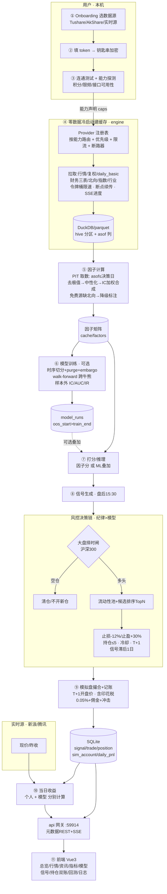

**关键纪律节点(贯穿数据流)**:
- 步骤⑤⑥⑦⑧ 全程走 `data.asof(dataset, fields, asof_date)`,从存储层杜绝未来函数。
- 财务数据按 `ann_date`(公告日)而非 `end_date`(报告期)取,根除「一季报 4 月底才公告」的泄漏。
- 信号 `T` 日盘后生成,`effective_date = T+1`,`T+1` 开盘价成交。
- 回测硬校验 `backtest_start > train_end + purge`,违反即拒跑。

---

## ④ 统一数据模型 · 服务职责边界 · Provider 定位(冲突裁决)

### 4.1 统一数据模型概览

两套存储**按数据形态正交分工**,这是全局唯一裁决:

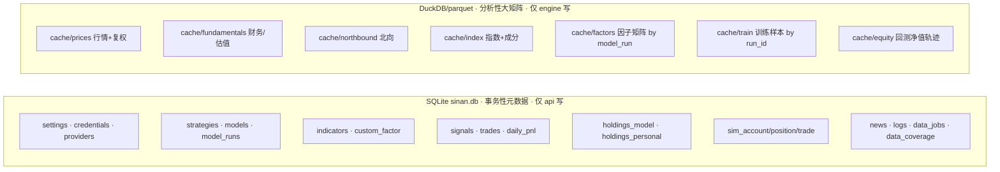

**裁决要点(消解专家命名差异)**:
- 模型层存在**两级**:`models`(逻辑模型/策略,跨版本)与 `model_runs`(训练运行/版本)。训练专家的 `model_registry` 与后端专家的 `model_runs` 是**同一张表的两个视角**,统一命名为 **`model_runs`**,字段取两者并集(含 `fingerprint`、`oos_start`、`vs_baseline`、`verdict`、`status` 状态机、`curves_path`)。
- 模拟盘账本存在两种粒度的表述(后端专家的 `holdings_model/trades` vs 量化专家的 `sim_position/sim_trade/sim_account`)。**裁决**:`sim_account/sim_position/sim_trade/sim_daily_return` 为模拟盘**内部记账权威表**(engine 写);`holdings_model`/`trades(portfolio=model)`/`daily_pnl(portfolio=model)` 为**对前端展示的统一视图**(api 维护)。engine 跑完模拟盘后,结果经 `POST /internal/...` 回传 api,由 api 落地展示视图。个人持仓只有 `holdings_personal` + `trades(portfolio=personal)` + `daily_pnl(portfolio=personal)`,手动维护。
- `portfolio`/`book` 维度统一取值 **`'model' | 'personal'`**,两套账本物理隔离,**严禁误聚合**。
- 因子矩阵按 `model_run` 分区隔离,保证每个模型版本特征可复现、可审计。

### 4.2 服务职责边界(三层硬边界)

> 原则:**Vue 不碰业务规则,NestJS 不碰数值计算,FastAPI 不碰前端契约与多端协调。**

| 层 | 负责 | 明确不负责 |
|---|---|---|
| **Vue3** | 渲染、交互、本地 UI 态、轮询/SSE 订阅、盈亏色与系统色解耦展示 | 任何 alpha/风控判定、任何持久化、任何凭据明文。**前端永不直连 engine** |
| **NestJS(api)** | REST 契约/DTO 校验、**SQLite 唯一写者**与事务、任务编排与调度(@Cron)、SSE 总线、凭据解密代理(向钥匙串取明文只在内存转发)、对 engine 的重试/编排 | 因子公式求值、模型前向、回测撮合、行情解析 |
| **FastAPI(engine)** | Provider 接入、因子/指标计算、回测、估值、训练/推理、模拟盘撮合与风控、写列式缓存 | 跨请求任务编排、给前端的稳定 REST 契约、用户态管理 |

**SQLite 单一写者裁决**:多进程并发写 SQLite 必然 `database is locked`。**api 是唯一写者**(WAL 模式);engine 对元数据库**只读**,需落库的结果(训练完成、信号、交易、指标)一律经 `POST /internal/...` 回传 api 写入。一致性边界收敛到一处。engine 对 DuckDB/parquet 独占写。

### 4.3 Provider 抽象层定位

Provider 抽象层是**整个 BYO 地基的承重墙**,位于 engine 内,是所有出网数据访问的唯一入口:

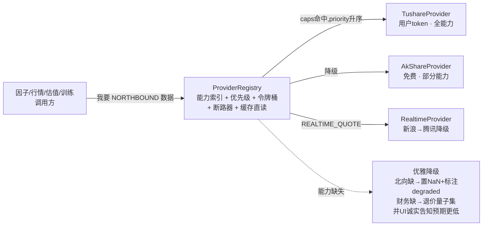

**统一裁决(能力枚举)**:以系统架构章的 `Capability` 为准,补齐量化章的细分,最终能力位集合 = `{DAILY_OHLCV, ADJ_FACTOR, REALTIME_QUOTE, FUNDAMENTAL, FINA_INDICATOR, DAILY_BASIC, NORTHBOUND, INDEX_OHLCV, INDEX_WEIGHT, SW_INDUSTRY, EARNINGS_FORECAST, TRADE_CAL}`。Provider 声明能力,调用方只表达需求,注册表按 `priority` 升序路由、失败熔断降级。新增源(聚宽/米筐/自定义)= 实现接口 + 注册,**零侵入**调用方。

降级**永不静默**:每次因子合成产出 `coverage` 报告(生效因子数/应有数),写入信号详情、`daily_pnl.degraded` 标记与日志;UI 红字告知「当前为免费源,因子覆盖受限,样本外预期更低」。

---

## ⑤ 统一 API 契约总表

**前端只与 api(`:59914`,前缀 `/api/v1`)对话;engine(`:59915`)仅 api 可达(校验 `X-Sinan-Internal`)。** 长任务返回 `202 {job_id/run_id}`,经 SSE 推进度。契约的单一真相源在 `packages/shared-contracts`(TS+py 共享 DTO)。

### 5.1 前端 ↔ api(`/api/v1`)

| 域 | 方法 端点 | 说明 |
|---|---|---|
| 健康 | `GET /health` | 聚合 api+engine,`{status,db_ok,gpu,engine_ok}` |
| 引导 | `GET /onboarding/state` · `POST /onboarding/complete` | 向导状态机 |
| 数据源 | `GET /providers` · `PUT /providers/active` | 源列表+caps+status;切换主源 |
| 凭据 | `GET/PUT/DELETE /providers/:id/credential` | 写=加密落盘**永不回显**,读=`{configured,fingerprint}` |
| 连通 | `POST /providers/:id/test` | 校验token+探积分/限频/能力 |
| 缓存/作业 | `POST /jobs` · `GET /jobs[/:id]` · `PATCH /jobs/:id` | 建缓存/增量/训练等;暂停/恢复/取消 |
| 作业流 | `GET /events/jobs/:id`(SSE) | 进度/loss/AUC/已下载只数 |
| 策略 | CRUD `/strategies[/:id]` | 风控选股参数 |
| 模型 | `GET/POST /models[/:id]` · `POST /models/:id/train` | 训练校验 `oos_start>train_end` |
| 版本 | `GET /models/:id/runs[/:rid]` · `GET /runs/:rid/curves` · `PUT /models/:id/active-run` | 版本/曲线/激活 |
| 诊断 | `GET /models/:id/diagnostics` · `GET /models/:id/shadow` | IC/分层/影子对比 |
| 指标 | CRUD `/indicators` · `POST /indicators/validate` · `POST /indicators/preview` · `POST /indicators/evaluate` | 自定义公式校验(含前视检查)+IC质检 |
| 行情 | `GET /quotes?codes=` · `GET /prices/:code` | 实时报价 / 历史日线 |
| 信号 | `GET /signals?date=` · `POST /signals/generate` | 当日信号(含被拦截组)/手动触发 |
| 持仓 | `GET /portfolios/model/holdings` · CRUD `/portfolios/personal/holdings` | 两套分账 |
| 成交 | `GET /trades?portfolio=&from=&to=` | 流水(含成本明细) |
| 当日收益 | `GET /pnl/daily?portfolio=` | 个人/模型**分别** |
| 模拟盘 | `POST /paper/run` | 盘后跑一轮 |
| 回测 | `POST /backtests` | 校验 `start>train_end` |
| 资讯 | `GET /news` · `POST /news/:id/interpret` | AI 解读(本机) |
| 日志 | `GET /logs` · `GET /logs/stream`(SSE) | 统一日志总线 |
| 设置 | `GET/PUT /settings[/:key]` | 主题/刷新/调度/风控等 |

### 5.2 api ↔ engine 内部(`:59915`,`X-Sinan-Internal`)

| 端点 | 说明 |
|---|---|
| `POST /engine/cache/build` · `/cache/incremental` | 建缓存(断点/限速)/增量 |
| `POST /engine/factors/compute` · `/factors/score` | 因子矩阵 / 多因子合成打分(含降级报告) |
| `POST /engine/indicators/eval` · `/factor/custom/validate` | 自定义公式安全求值 / PIT 穿越校验 |
| `POST /engine/train/run` · `GET /engine/train/progress/:id` | 训练 / 进度回调 |
| `POST /engine/infer` · `/engine/predict` | 推理打分(预处理一致性) |
| `POST /engine/signals/generate` · `/engine/paper/run` | 出信号 / 模拟盘决策链 |
| `POST /engine/backtest` · `/engine/valuation` | 回测 / 估值 |
| `POST /engine/quotes` · `/engine/prices` | 实时报价(新浪→腾讯)/ 历史 |
| `GET /engine/calendar/is-trade-day` · `POST /engine/provider/test` | 交易日判定 / 连通探测 |
| `POST /internal/tasks/:id/progress` · `/internal/results/*` | engine→api 回传进度与落库结果 |

---

## ⑥ 开发路线图 M0..M6

每个里程碑 = **范围 + 验收标准 + 可演示成果**。原则:**M0 先把「自带数据源 + 零数据冷启动建缓存」打通**(这是地基,没有它一切是空中楼阁),随后最简多因子策略端到端,再迭代训练/自定义指标/资讯。

---

### M0 — 地基:Onboarding + 数据源接入 + 零数据冷启动建缓存 ★必须最先

**范围**:Tauri 外壳 + 双 sidecar 起停监护;端口探测/会话 token;Provider 抽象层骨架 + TushareProvider + AkShareProvider + RealtimeProvider;OS 钥匙串凭据加密;SQLite/DuckDB 初始化与迁移;Onboarding 5 步向导;`cache_build` 作业(令牌桶限速/断点续传/SSE 进度);`data_coverage` 增量台账;统一日志总线 + 日志页;健康检查与启动遮罩。

**验收标准**:
- 全新安装(空 `$APPDATA/Sinan`)→ 首启进向导;填入用户 Tushare token → 测试连接返回积分/限频/能力矩阵;token 仅入钥匙串,DB 无明文,`grep` 任何日志/DB 文件搜不到明文 token。
- 建缓存能拉到 ≥N 只股票日线+daily_basic+(有北向时)北向,写入 parquet,DuckDB 视图可查;中途杀进程→重启→从游标续传,不重拉已完成部分。
- 选 AkShare(无 token)亦可完成建缓存,北向能力位标 `false`。
- 端口被占用时自动顺延;关窗后托盘常驻,sidecar 不留孤儿进程。

**可演示成果**:从空盘到「本地已有 X 只股票、覆盖 2018–至今、占用 Y GB」的缓存,全程进度条,**全本机、token 加密、可断点续传**。

---

### M1 — 最简多因子策略端到端(打分→信号→模拟盘→当日收益)

**范围**:因子库最小集(价值 EP/BP + 质量 ROE + 动量 + 北向 1–2 个)+ PIT 取数 `data.asof`;横截面处理(去极值/zscore/行业中性化/IC 加权);`factor_score` 打分;风控决策链全闸(大盘择时/流动性池/持仓≤5/止损止盈/T+1/冷却);模拟盘撮合记账(含印花税0.05%+佣金+冲击);盘后 15:30 调度;实时源当日收益(个人+模型分别);前端总览/信号/持仓双账/行情基础页。

**验收标准**:
- 盘后自动产出当日信号(buy/sell/hold),被风控拦截的信号单独成组并标原因。
- 模拟盘按 T+1 开盘价撮合,流水含完整成本明细;`sim_account` 净值逐日更新。
- 大盘择时闸生效:沪深300<MA20 时不开新仓/清仓,信号标 `market_filter`。
- 当日收益个人与模型**两套独立**,数据来自实时源 `现价 vs 昨收`。
- **诚实校验脚本**:对历史任一日,截断 `>T` 数据重算打分,结果一致(无未来函数)。

**可演示成果**:一个无 ML、纯因子打分的完整策略闭环 —— 盘后出信号、自动模拟买卖、总览页双账当日收益 + 模型净值 vs 沪深300。

---

### M2 — 回测引擎 + 诚实评估口径

**范围**:事件驱动+向量化回测(逐日撮合/成本/滑点);时序切分+purge+embargo;walk-forward 跨牛熊;绩效指标全集(年化/超额/IR/Sharpe/MaxDD/换手/胜率/Calmar/RankIC/ICIR);回测页(净值 vs 基准+回撤阴影、月度热力图、防未来函数提示条)。

**验收标准**:`backtest_start ≤ train_end+purge` 时引擎拒跑并报错;回测含成本后超额、跟踪误差、IR;walk-forward 输出每 fold 样本外指标;UI 顶部恒显「信号滞后1日·purge N日·仅测训练截止后·含交易成本」,任一关闭标「⚠非诚实口径」。

**可演示成果**:对 M1 策略跑一次跨牛熊 walk-forward 回测,展示诚实样本外曲线与「略跑赢沪深300 + 回撤更小」的现实结果。

---

### M3 — 模型训练流水线(ML 可选叠加)

**范围**:特征工程(因子矩阵→样本)、标签构造(未来N日超额,信号滞后1日,标签泄漏自检)、LightGBM/ElasticNet 基线、训练任务编排(可暂停/续训/取消、checkpoint、CPU/GPU 探测)、SSE 实时 loss/AUC/IC 曲线、模型注册与版本管理(指纹/OOS 指标/verdict)、影子对比、推理部署、模型页+训练向导页。

**验收标准**:训练全程本机、无外发网络;报告指标**一律样本外**,UI 同显样本内 vs 样本外并对过拟合红字警告;ElasticNet 基本面基线常在场,ML 须 OOS 超基线才不打 `weak`;`verdict` 按 RankIC/IR 阈值判定,**UI 明示「AUC 0.52 是正常水平,不是 bug」**;训练可中断后从 checkpoint 续训。

**可演示成果**:训练一个 `factor + LightGBM 叠加` 模型,实时看 loss/AUC 曲线,完成后自动样本外回测,版本库展示 OOS IR 与「vs 基线增量」。

---

### M4 — 指标库 + 自定义因子表达式

**范围**:内置技术指标库;自定义因子 DSL + 白名单 AST 安全沙箱(禁 import/属性/任意调用);前视/未来函数静态检查 + 随机日穿越测试;因子质检(分层 IC/ICIR/衰减/拥挤度);指标编辑器三栏页;启用指标进入模型特征池与行情叠加。

**验收标准**:恶意表达式(含 `__`、import、文件/网络)被拒;含未来函数的公式在穿越测试中被检出并拒绝注册;质检产出 IC/ICIR 内联展示;自定义因子版本化可回滚。

**可演示成果**:用户写 `zscore(-pe)*0.4 + zscore(roe)*0.4 + rank(north_hold_chg_5)*0.2`,校验通过、质检出 IC,启用后进入模型。

---

### M5 — 资讯(AI 解读)+ 估值页 + 桌面特性完善

**范围**:资讯抓取(用户源)+ 本机 AI 摘要/情绪/影响标的;估值页(PE/PB 分位、基本面);桌面悬浮窗(个人+模型当日收益+择时闸)、系统托盘速览、SMTP 通知、桌面通知、开机自启、关闭行为。

**验收标准**:AI 解读全本机推理无外发;悬浮窗 always-on-top 显双账当日收益;SMTP 测试邮件可发,密码存钥匙串;托盘 tooltip 显模型当日收益。

**可演示成果**:盘后信号生成→桌面通知+SMTP→悬浮窗实时盈亏;资讯页 AI 解读关联持仓。

---

### M6 — 打包分发 + 自动更新 + 跨平台加固

**范围**:Tauri bundler 产 `.msi/.exe`(Win 优先)、`.dmg`、`.AppImage/.deb`;engine PyInstaller 冻结、api Node SEA 冻结;tauri-plugin-updater(Ed25519 签名);SQLite 迁移向后兼容;跨平台进程信号/钥匙串/GPU 探测加固;中文字体内置。

**验收标准**:安装包**不含** cache/models/token;干净机器安装即用(免装 Python);更新只下签名版本、不动用户数据、不回传任何数据;Win/mac/Linux 三平台冷启动 ≤15s。

**可演示成果**:一个可分发安装包,在全新机器上从零跑通 M0→M1 全流程。

---

## ⑦ 给 Claude Code 的执行指引

### 代码库结构与单一真相源

- 以 ④2 顶层目录为准。**契约先行**:任何跨服务 DTO/端点/枚举先写进 `packages/shared-contracts`,TS 与 Python 双向生成/校验,避免前后端漂移。
- **能力枚举、风控默认参数、切分参数**集中在 shared-contracts 与 `config.defaults.json`,三层配置(打包默认 < SQLite settings < `SINAN_*` 环境变量)。

### 构建顺序(严格自底向上)

```
1. shared-contracts(DTO/端点/枚举/能力位)
2. engine: providers 抽象 + Tushare/AkShare/Realtime + 钥匙串读取接口
3. SQLite 迁移 + DuckDB 布局 + data.asof 取数入口
4. engine: cache_build 作业(限速/断点/SSE)
5. api: 单一写者仓储 + /jobs + SSE 总线 + 凭据解密代理
6. Tauri: supervisor 起停监护 + 端口探测 + 钥匙串 + 启动遮罩
7. 前端: AppShell + Onboarding 向导 + 数据源设置页
   —— 至此 M0 闭环可演示 ——
8. engine: 因子库 + 横截面处理 + 打分 + 风控决策链 + 模拟盘记账 + 调度
9. 前端: 总览/信号/持仓双账/行情  —— M1 闭环 ——
10. 回测(M2)→ 训练(M3)→ 指标(M4)→ 资讯(M5)→ 打包(M6)
```

### 每步自测方法

| 层 | 自测 |
|---|---|
| Provider | 单测 mock HTTP;`test_connection` 对真实 token 手测一次;能力缺失走降级路径有单测 |
| 缓存 | 建缓存→杀进程→续传,断言无重复行;`data_coverage` 区间正确 |
| PIT/防未来 | **黄金测试**:对历史日 T,截断 `>T` 数据重算因子/打分,断言与全量一致 |
| 风控链 | 构造沪深300<MA20 场景断言空仓;构造持仓=5 断言不再开新仓;T+1 断言当日买不可卖 |
| 训练 | 标签泄漏断言(`label_end ≤ train_cutoff`);切分无随机 shuffle;OOS 日期 > train_end |
| 回测 | `start ≤ train_end+purge` 断言抛错;成本计入断言 |
| API | 契约测试(shared-contracts schema 校验);凭据接口断言响应**不含**明文 |
| 前端 | 盈亏 class 与系统 class 永不交叉的单测;锁定态守卫;骨架/空/错三态 |

### 红线(违反即回退,不可协商)

1. **严禁未来函数**:任何取数走 `data.asof`;财务按 `ann_date`;信号滞后1日;切分仅按日期+purge+embargo;自定义因子过穿越测试。**黄金测试不过 → 不合并。**
2. **严禁虚假回测**:回测只测 `train_end+purge` 之后;必须含交易成本(印花税0.05%+佣金+冲击);随机切分一律禁止。
3. **严禁夸大收益**:报告指标一律样本外;UI 同显样本内 vs 样本外;不得隐藏成本后结果;AUC 0.52 如实标注为正常。现实预期锚定「IR 0.5–1.0、略跑赢沪深300、控回撤」。
4. **严禁捆绑 token 或数据**:安装包零 token/零数据/零模型;token 只入钥匙串,DB/日志/SSE/前端响应**永不**出现明文;除用户自配源拉取与签名更新外,**零外联**。
5. **严禁自动真实下单**:只做纸面模拟盘 + 手动个人持仓;不对接券商交易接口。
6. **严禁前端直连 engine**;**严禁 engine 写 SQLite 元数据库**(只读)。

### Definition of Done(每个 PR)

- [ ] 跨服务改动已更新 `shared-contracts` 且双端校验通过
- [ ] 新增取数路径走 `data.asof`,附黄金测试(若涉及因子/标签/回测)
- [ ] 凭据/token 不出现在任何日志、DB、响应、SSE
- [ ] 长任务有进度回传 + 可取消;失败保留 cursor/checkpoint
- [ ] 涉及收益展示的,样本内外分离、成本计入、盈亏色与系统色解耦
- [ ] 单测 + 关键路径集成测试绿;无孤儿进程
- [ ] 中文界面;免责声明常驻信号/资讯/模拟盘页
- [ ] 在干净 `$APPDATA/Sinan` 下能跑通该 PR 所属里程碑的演示路径

---

## ⑧ 风险与诚实免责声明

### 工程与产品风险

| 风险 | 缓解 |
|---|---|
| **免费价量≈无 alpha**(AlphaQuant 实测样本外超额≈+0.78%≈跟随指数) | 默认策略以基本面+北向多因子为主;免费源降级时 UI 诚实告知预期更低;ML 仅作可选叠加且须 OOS 超基线 |
| **未来函数泄漏**(最易翻车) | 存储层 `asof` 语义 + `ann_date` 取数 + purge/embargo + 黄金穿越测试 + 自定义因子静态检查,多重防线 |
| **过拟合/多重检验** | walk-forward 跨牛熊;样本内外并列展示;搜参次数记账提示;影子对比数月再晋升 |
| **因子拥挤与衰减** | 回测含冲击成本;高换手/IC 衰减因子降权;换手率指标常驻 |
| **数据源限频/封禁** | 令牌桶按积分限速;断路器熔断降级;指数退避;断点续传 |
| **凭据泄漏** | OS 钥匙串优先 + AES-GCM 兜底;出网白名单;token 永不落明文/上传 |
| **进程/数据损坏** | supervisor 崩溃重启 + checkpoint;`data_coverage` 校验和;SQLite WAL + 单写者 |

### 诚实免责声明(必须常驻 UI 与文档)

> **司南是研究与纪律辅助工具,不是投资顾问,更不是赚钱机器。**
> - 所有信号、打分、回测、模拟盘结果**仅供研究参考,不构成任何投资建议**。
> - 模拟盘为**纸面前向验证**,不构成真实交易,司南**不进行任何自动真实下单**。
> - 量化模型在 A 股横截面选股上的有效信号本就**微弱**(AUC 0.50–0.53 是常态,不是 bug);真正价值来自「在大量股票上稳定地略微占优 + 严格风控纪律」,而非高 AUC 或预测涨跌。
> - 现实预期是**长期略微跑赢沪深300几个百分点 + 回撤更小(目标 IR 0.5–1.0)**,**不是暴富**。
> - 历史回测不代表未来收益;请用模拟盘纸面前向验证**数月**、OOS 指标持续为正后,再谨慎考虑投入真钱。
> - 你的数据、token、模型**全程留在你自己的电脑上**,司南不收集、不上传、不上云。

---

*本总纲为执行权威。五个专章提供实现细节,凡有冲突以本总纲 ④ 的裁决为准。下一步:Claude Code 从 M0 第 1 步(shared-contracts)开始,严格按构建顺序与红线推进。*


---

# 附录 · 各专家详细设计

# 系统架构师

I now have enough grounding in the prototype's reality (multi-source fallback with priority + degradation, CSV cache + JSON sidecars, point-in-time liquidity pool, schedule-based 15:30 scheduler, Flask dashboard on 127.0.0.1). This directly informs the Provider abstraction, storage migration, sidecar, and observability sections. Writing the chapter now.

# 系统架构

本章定义司南(Sinan)的整体技术架构。设计目标明确:**可分发**(随包零数据/零模型/零 token)、**全本机**(凭据与数据永不离开本机)、**可插拔**(数据源 Provider 抽象层,Tushare 首选并可优雅降级)、**诚实**(从 AlphaQuant 原型继承的无未来函数纪律由数据层强制保障)。架构在原型「罗盘」的多源降级、列式缓存、点位池(point-in-time)、盘后调度等既有实现之上正式化重写,把散落在 Flask 单体里的逻辑切成清晰的三层。

## 1. 整体架构:Tauri shell + 双 sidecar

司南是单进程树的桌面应用:Tauri(Rust)主进程是**唯一的生命周期主宰**,负责拉起、监护、优雅终止两个本地 sidecar 子进程;前端 Vue3 跑在 Tauri 的 WebView 里,只通过 HTTP 与本机后端通信。

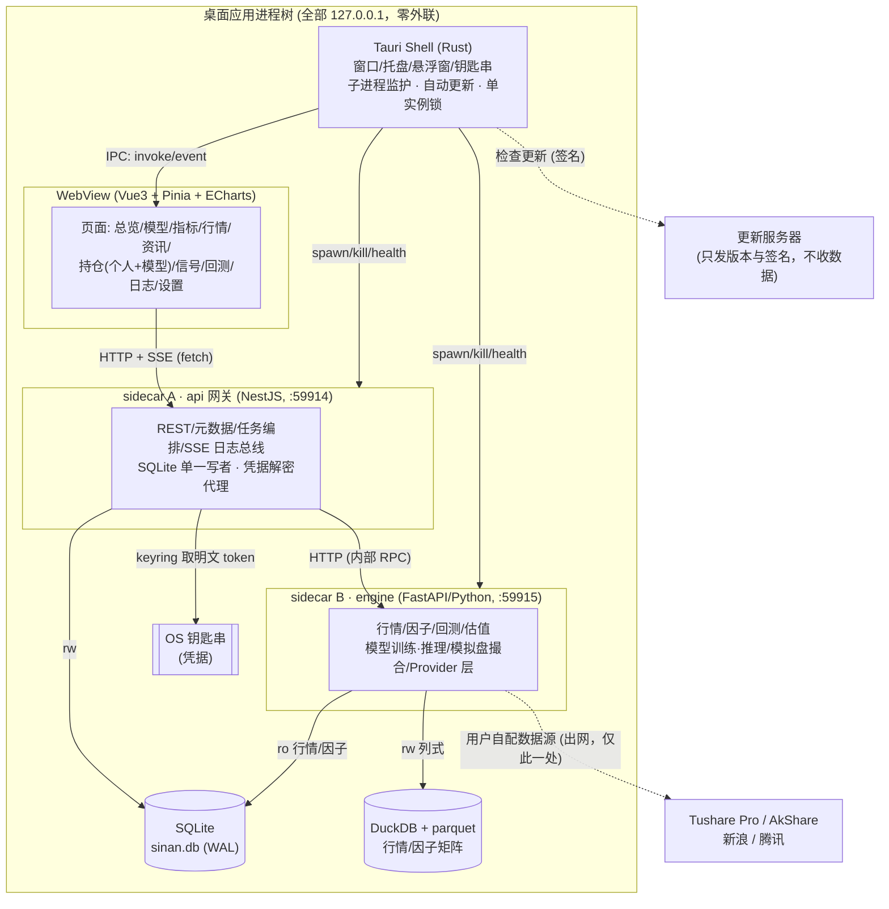

**为什么是双 sidecar 而非单后端**:量化引擎天然是 Python 生态(pandas/torch/tushare/akshare),无可替代;但任务编排、SQLite 事务、REST 契约、SSE 推送用 NestJS 写更结构化、类型更安全。两者用本机 HTTP 解耦,各自可独立重启、独立崩溃恢复,也便于将来把 engine 换成更重的训练后端。代价是多一跳网络与一个进程,在本机回环上延迟可忽略。

### 1.1 端口分配与发现

固定参考端口 api=59914、engine=59915,**但不写死**:Tauri 启动时先探测端口是否被占用,占用则在 59900–59999 段内顺延,把最终端口通过两条途径下发:

- 写入运行期文件 `$APPDATA/Sinan/runtime/ports.json`(`{"api":59914,"engine":59915,"token":"<本次会话随机32字节>"}`);
- 作为环境变量 `SINAN_API_PORT` / `SINAN_ENGINE_PORT` / `SINAN_IPC_TOKEN` 注入两个 sidecar 与前端 bootstrap。

所有 sidecar **只 bind `127.0.0.1`**,并校验每个请求头 `X-Sinan-Token` 等于本次会话随机 token——防止本机其它进程/浏览器跨站打到后端(CSRF/端口扫描)。engine 只接受来自 api 的请求(同样校验 token),不直接面向前端。

### 1.2 生命周期、健康检查、优雅退出、崩溃重启

Tauri 主进程内置一个 **Supervisor**(Rust)管理子进程状态机:

```
Spawning → Probing(健康探测) → Healthy → (Degraded) → Stopping → Stopped
                                   ↘ Crashed ↗(指数退避重启)
```

| 机制 | 实现 |
|---|---|
| 健康检查 | 启动后轮询 `GET /healthz`(api)与 `GET /healthz`(engine),`{status,version,db_ok,gpu}`;就绪前前端显示「正在启动本地引擎…」启动屏。心跳间隔 5s,连续 3 次失败标记 Crashed。 |
| 启动顺序 | engine 先就绪 → api 再就绪(api 的 `/healthz` 依赖能连上 engine)→ 通知前端解锁。冷启动总预算 ≤ 15s,超时报「引擎启动失败」并附日志入口。 |
| 优雅退出 | 关闭窗口时,Supervisor 先发 `POST /admin/shutdown`(子进程停掉调度器、flush 日志、关闭 DuckDB/WAL checkpoint),宽限 5s;未退则 `SIGTERM`(Windows: `CTRL_BREAK`/`taskkill /T`),再 3s 后 `SIGKILL`。保证不留孤儿进程(子进程以 job object / process group 绑定主进程)。 |
| 崩溃重启 | Crashed 后指数退避重启(1s/2s/4s/8s,上限 5 次/10 分钟);训练任务被 engine 崩溃打断时,任务状态置 `interrupted` 并保留最近 checkpoint,前端给「继续/放弃」。 |
| 单实例 | Tauri single-instance 插件 + 文件锁 `runtime/sinan.lock`,二次启动只激活已有窗口(避免两个进程抢 SQLite 写锁与端口)。 |
| 关闭行为 | 沿用原型设置:最小化到托盘 / 直接退出,二选一;托盘模式下 sidecar 继续跑,保证盘后 15:35 自动出信号即使主窗口关闭也执行。 |

## 2. 三层调用边界:Vue ↔ NestJS ↔ FastAPI

职责切分的原则:**Vue 不碰业务规则,NestJS 不碰数值计算,FastAPI 不碰前端契约与多端协调**。

| 层 | 技术 | 负责 | 明确不负责 |
|---|---|---|---|
| 表现层 | Vue3 + Pinia + Vue Router + ECharts | 渲染、交互、本地 UI 态、轮询/SSE 订阅、红涨绿跌与状态色解耦的展示逻辑 | 任何 alpha/风控判定、任何持久化、任何凭据明文 |
| 网关层 | NestJS (Fastify adapter) | REST 契约与 DTO 校验(class-validator)、**SQLite 单一写者**与事务、任务队列与调度、SSE 日志/进度总线、凭据解密代理(向钥匙串取明文 token 只在内存中转发给 engine)、对 engine 的编排与重试 | 因子公式求值、模型前向、回测撮合、行情解析 |
| 引擎层 | FastAPI (Python, uvicorn) | Provider 数据接入、因子/指标计算、回测、估值、模型训练/推理、模拟盘撮合与风控、写列式缓存 | 跨请求的任务编排、给前端的稳定 REST 契约、用户态管理 |

**为什么把 SQLite 写权收归 NestJS 单点**:SQLite 单写者模型下,多进程并发写极易 `database is locked`。让 api 作为唯一写者(WAL 模式),engine 对元数据库**只读**(行情/因子从 DuckDB 读),需要落库的结果(训练完成、信号、交易、指标)通过 `POST /internal/...` 回传给 api 写入。这把一致性边界收敛到一处,事务清晰。

### 2.1 关键端点契约(节选)

前端面向的 api(`:59914`,前缀 `/api/v1`):

| 方法 端点 | 说明 |
|---|---|
| `GET /healthz` | 聚合自身与 engine 健康 |
| `GET /onboarding/state` / `POST /onboarding/complete` | 引导向导状态机 |
| `GET /providers` / `POST /providers/:id/test` | 列出已注册 Provider 及能力、连通测试 |
| `POST /settings/credentials` | 写凭据(转钥匙串,只回存 `ref`,绝不回明文) |
| `POST /datasets/build` → `{taskId}` | 触发冷启动建缓存 |
| `GET /tasks/:id` / `GET /tasks/:id/stream`(SSE) | 任务状态与进度(loss/AUC/已下载只数) |
| `POST /models/train` / `GET /models` / `POST /models/:id/promote` | 训练、版本列表、设为生效模型 |
| `GET /signals?date=` / `GET /holdings?book=model|personal` | 当日信号、两套持仓分账 |
| `POST /holdings/personal`(手动维护个人持仓) | 个人持仓 CRUD |
| `GET /pnl/today?book=` | 当日收益(个人/模型分别,用实时源现价×持仓) |
| `GET /indicators` / `POST /indicators`(自定义因子表达式) | 指标库与自定义公式 |
| `GET /logs/stream`(SSE) | 统一日志总线 → 日志页 |

引擎内部端点(`:59915`,仅 api 可达):`/quotes/realtime`、`/factors/compute`、`/backtest/run`、`/train/run`、`/infer/score`、`/paper/run-eod`、`/valuation/score`、`/indicators/eval`(自定义公式安全求值)。

### 2.2 长任务模型(训练/建缓存/回测)

均为异步:api 入队 → 调 engine 的 `/...run` 拿到 `taskId` → engine 后台执行并以 **进度事件流** 回推(engine `POST /internal/tasks/:id/progress` → api 落库 + 广播 SSE)。前端订阅 `GET /tasks/:id/stream`,实时画 loss/AUC 曲线、下载进度条。任务可取消(`POST /tasks/:id/cancel` → engine 设置协作式取消标志)。

## 3. 本地存储选型:SQLite vs DuckDB/parquet

两套存储**按数据形态分工**,这是从原型「CSV + 散落 JSON」正式化的关键升级:

- **SQLite(`sinan.db`,WAL)= 事务性元数据**:行少、强一致、需要 ACID 与关联查询的东西。策略、模型版本、持仓、交易流水、信号、指标定义、资讯、设置、加密凭据引用、任务、日志索引。
- **DuckDB + parquet = 分析性大矩阵**:行多、列式扫描、按日期/因子切片。原始行情(OHLCV+换手+北向等)、因子矩阵、训练样本、回测净值序列。DuckDB 直接 `SELECT ... FROM 'cache/factors/*.parquet'`,零拷贝、列裁剪、谓词下推,比原型逐文件 `read_csv` 快一个量级,且天然支持「扫全市场流动性中位数」这类聚合(原型 `get_tradeable_pool` 的强化版)。

| 维度 | SQLite | DuckDB/parquet |
|---|---|---|
| 数据 | 元数据/状态/流水 | 行情/因子/样本/净值 |
| 量级 | 万级行 | 千万~亿级行 |
| 访问 | 点查、事务、JOIN | 列扫、聚合、向量化 |
| 写者 | 仅 api(单写者) | 仅 engine(批量重写分区) |
| 备份 | 单文件复制 | 按分区目录 |

**为什么不全用 SQLite**:行情/因子是宽表大矩阵,SQLite 行存做全市场截面聚合会很慢且体积大。**为什么不全用 DuckDB**:DuckDB 的并发写与事务弱于 SQLite,不适合做高频小事务的状态库。两者**职责正交**,各取所长。

### 3.1 SQLite 核心表结构(节选)

```sql
-- 凭据:不存明文,只存钥匙串引用与算法元数据(token 实体在 OS 钥匙串)
CREATE TABLE credential (
  id INTEGER PRIMARY KEY,
  provider_id TEXT NOT NULL,            -- 'tushare' | 'akshare' | ...
  keyring_ref TEXT NOT NULL,            -- 钥匙串条目名,如 'sinan/tushare/token'
  enc_algo TEXT DEFAULT 'os-keychain', -- 或 'aes-gcm-sqlite' 兜底
  created_at TEXT, updated_at TEXT
);

CREATE TABLE provider_config (         -- 已启用的源、优先级、能力开关
  provider_id TEXT PRIMARY KEY,
  enabled INTEGER, priority INTEGER,   -- 数字小者优先;降级按此顺序
  rate_limit_per_min INTEGER,          -- 如 Tushare 500/分
  caps_json TEXT                       -- 声明的能力位(见 §5.2)
);

CREATE TABLE model_version (
  id INTEGER PRIMARY KEY, name TEXT,
  trained_at TEXT, train_cutoff TEXT,  -- 训练截止日(诚实样本外的边界)
  feature_dim INTEGER, hparams_json TEXT,
  metrics_json TEXT,                   -- {auc_oos, ic, sharpe_oos, ...}
  artifact_path TEXT,                  -- models/<id>/*.pt(随包不含,本机生成)
  status TEXT                          -- 'training'|'ready'|'active'|'archived'
);

CREATE TABLE signal (
  id INTEGER PRIMARY KEY, trade_date TEXT, stock_code TEXT,
  score REAL, action TEXT,             -- 'buy'|'sell'|'hold'
  model_version_id INTEGER, created_at TEXT
);

CREATE TABLE position (                -- 两套账本用 book 区分
  id INTEGER PRIMARY KEY,
  book TEXT NOT NULL,                  -- 'model' | 'personal'
  stock_code TEXT, shares REAL, avg_cost REAL,
  opened_at TEXT, source TEXT          -- 模拟盘自动 / 用户手动
);

CREATE TABLE trade (                   -- 流水(成本含印花税0.05%+佣金,见回测章)
  id INTEGER PRIMARY KEY, book TEXT, trade_date TEXT,
  stock_code TEXT, side TEXT, shares REAL, price REAL,
  commission REAL, stamp_tax REAL, reason TEXT
);

CREATE TABLE indicator_def (           -- 技术指标 + 用户自定义公式
  id INTEGER PRIMARY KEY, name TEXT, kind TEXT, -- 'builtin'|'custom'
  expr TEXT,                           -- 因子表达式(白名单 AST 求值)
  params_json TEXT, enabled INTEGER
);

CREATE TABLE log_entry (               -- 日志索引(全文落 parquet/滚动文件,见 §8)
  id INTEGER PRIMARY KEY, ts TEXT, level TEXT,
  source TEXT,                         -- 'tauri'|'api'|'engine'|'paper'|'train'
  trace_id TEXT, msg TEXT
);

CREATE TABLE setting (k TEXT PRIMARY KEY, v_json TEXT);
CREATE TABLE task (id TEXT PRIMARY KEY, kind TEXT, status TEXT,
                   progress REAL, payload_json TEXT, result_json TEXT,
                   created_at TEXT, updated_at TEXT);
```

### 3.2 DuckDB/parquet 布局

```
cache/
  ohlcv/      board=sh/ year=2023/ part.parquet     -- 按板块+年份分区
  factors/    asof=20240131/ factors.parquet        -- 因子矩阵(point-in-time)
  fundamental/ ...                                   -- 财务三表/fina_indicator
  northbound/ ...                                    -- moneyflow_hsgt
  samples/    model=lstm_v3/ train.parquet           -- 训练样本(冻结,可复现)
  equity/     run=<backtestId>/ nav.parquet          -- 回测净值/持仓轨迹
```

分区键的选择直接服务诚实评估:因子与样本带 `asof` 列(数据可见日),引擎读取时**只取 `asof ≤ 决策日` 的行**,从存储层杜绝未来函数;信号滞后 1 日、回测只测 `train_cutoff` 之后,均靠这套 as-of 语义落实。

## 4. 顶层目录结构

```
sinan/
├─ apps/
│  └─ desktop/                  # Tauri 应用
│     ├─ src/                   # Vue3 前端 (views/ components/ stores/ api/)
│     ├─ src-tauri/             # Rust 外壳
│     │  ├─ src/supervisor.rs   # 子进程监护/健康/重启
│     │  ├─ src/keychain.rs     # 钥匙串读写 (keyring crate)
│     │  ├─ src/ports.rs        # 端口探测/下发
│     │  ├─ tauri.conf.json     # 含 updater/bundle 配置
│     │  └─ binaries/           # sidecar 可执行(打包期注入,见 §6)
│     └─ package.json
├─ services/
│  ├─ api/                      # NestJS 网关
│  │  ├─ src/modules/{providers,models,signals,holdings,pnl,
│  │  │                 indicators,onboarding,tasks,logs,settings}/
│  │  ├─ src/db/                # SQLite 迁移/单写者仓储
│  │  └─ src/bus/               # SSE 日志/进度总线
│  └─ engine/                   # FastAPI 引擎
│     ├─ providers/             # ★ Provider 抽象层(见 §5)
│     │  ├─ base.py             # IDataProvider 接口 + Capability 枚举
│     │  ├─ registry.py         # 注册表 + 路由/降级
│     │  ├─ tushare_provider.py
│     │  ├─ akshare_provider.py
│     │  └─ realtime_provider.py# 新浪/腾讯现价(继承自原型 realtime.py)
│     ├─ data/    factors/  models/  backtest/  valuation/
│     ├─ paper/                 # 模拟盘撮合/风控/记账(继承 paper_trading/)
│     └─ app.py                 # uvicorn 入口
├─ packages/
│  └─ shared-contracts/         # TS/py 共享 DTO 与端点常量(单一真相源)
└─ docs/                        # 架构/部署
```

运行期用户数据**不在安装目录**,统一落 OS 约定目录(可分发的前提):`%APPDATA%\Sinan\`(Win)/ `~/Library/Application Support/Sinan/`(mac)/ `~/.local/share/sinan/`(Linux),内含 `sinan.db`、`cache/`、`models/`、`logs/`、`runtime/`。安装目录保持只读、可被覆盖更新。

## 5. 数据源 Provider 抽象层

这是「BYO + 可插拔 + 优雅降级」的架构核心,把原型 `loader.py` 里硬编码的「腾讯→搜狐→新浪」降级链正式化为**接口 + 注册表 + 能力声明**三件套。

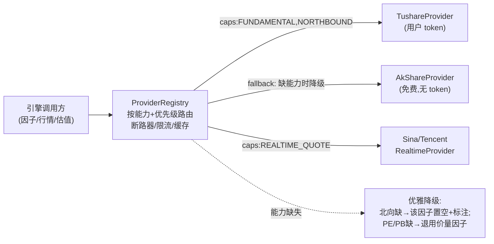

### 5.1 接口

```python
class Capability(Flag):
    DAILY_OHLCV      = auto()   # 日线行情(前复权)
    ADJ_FACTOR       = auto()   # 复权因子
    REALTIME_QUOTE   = auto()   # 现价/昨收(当日收益、盘中刷新)
    FUNDAMENTAL      = auto()   # 财务三表
    FINA_INDICATOR   = auto()   # 财务指标
    DAILY_BASIC      = auto()   # PE/PB/换手/市值
    NORTHBOUND       = auto()   # 北向 moneyflow_hsgt
    INDEX_OHLCV      = auto()   # 指数行情(沪深300择时闸)
    INDEX_WEIGHT     = auto()   # 指数成分
    SW_INDUSTRY      = auto()   # 申万行业
    EARNINGS_FORECAST= auto()   # 盈利预测
    TRADE_CAL        = auto()   # 交易日历

class IDataProvider(ABC):
    id: str; display_name: str
    capabilities: Capability                 # 声明自己能干什么
    rate_limit_per_min: int

    @abstractmethod
    def test_connection(self) -> ProviderHealth: ...      # onboarding 连通测试
    @abstractmethod
    def get_daily(self, code, start, end) -> DataFrame: ...
    def get_realtime(self, codes) -> dict: ...
    def get_fundamental(self, code, period) -> DataFrame: ...
    def get_northbound(self, date) -> DataFrame: ...
    def get_trade_cal(self, start, end) -> list: ...
    # 不支持的能力:抛 CapabilityNotSupported,由注册表捕获并降级
```

### 5.2 注册表与降级策略

`ProviderRegistry` 维护已启用 Provider 的**能力索引**(能力位 → [按 priority 排序的 provider])。调用方只表达「我要 NORTHBOUND 数据」,不关心来源:

1. **路由**:取声明了该 capability 且 enabled 的 provider,按 priority 升序尝试。
2. **优雅降级**:Tushare(用户填了 token,priority=10)→ AkShare(免费,priority=20)→ 现价源。免费源缺北向/盈利预测等字段时,不报死,而是**能力降级**:该因子在因子矩阵里置 `NaN` 并打标 `source=degraded`,因子合成层据此减权或回退到价量因子(呼应 AlphaQuant 教训:免费价量≈无 alpha,北向/基本面才是杠杆——所以 UI 会明确告诉用户「当前为免费源,因子覆盖受限,样本外预期更低」)。
3. **限流**:每 provider 一个令牌桶(Tushare 按用户积分填 `rate_limit_per_min`,如 500),超额排队而非打挂。
4. **断路器**:连续失败 N 次熔断 30s,自动切下一优先级 provider,恢复后半开探测——把原型里分散在每个 `_fetch_*` 的重试退避收敛为统一策略。
5. **缓存直读**:命中 DuckDB 缓存且未过期则不出网(原型「优先本地缓存、增量更新」语义保留)。

新增数据源(聚宽/米筐/自定义)= 实现 `IDataProvider` + 在注册表登记,**零侵入**调用方。

## 6. 凭据安全存储

铁律:**不明文、不上传、不随包**。

- **首选 OS 钥匙串**(Tauri `keyring` crate):Windows Credential Manager / macOS Keychain / Linux Secret Service。token 实体存于钥匙串条目 `sinan/<provider>/token`;SQLite 只存 `keyring_ref`,绝不存 token。
- **兜底(无钥匙串的 Linux 等)**:`aes-gcm-sqlite`——用从 OS 机器标识 + 用户口令(可选)派生的密钥(Argon2id)加密后存 `credential` 表,密钥不落盘。
- **取用路径**:仅 api 在处理出网请求时,临时向钥匙串取明文,通过本机回环 + 会话 token 转发给 engine,用完即弃,不写日志、不进 SSE、前端永不可见(设置页只显示「已配置 ••••」与最后校验时间)。
- **出网白名单**:engine 仅允许访问已注册 provider 的域名;Tauri CSP 禁止 WebView 直接发起任意外联。除「用户自配数据源」与「检查更新(只下签名版本,不上传任何数据)」外,无任何出站连接。

## 7. 首次启动 onboarding 与零数据冷启动

软件随包**零数据、零模型、零 token**。首启进入引导向导(状态机存 `setting: onboarding_step`):

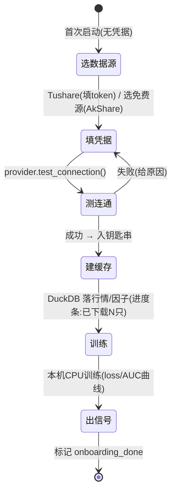

- **选数据源**:展示各 provider 能力矩阵与「样本外预期」提示(免费源覆盖受限)。
- **测连通**:Tushare 校验 token 与积分级别并据此设限流;免费源校验可达性。
- **建缓存(冷启动)**:`POST /datasets/build` 异步拉取股票列表 + 历史行情 + 基本面/北向(能力允许时),写 DuckDB,**进度通过 SSE 实时回显**(继承原型并发拉取 + 限流防封的经验)。可选「快速模式」(少量股票近 3 年,先跑通)或「完整模式」(全市场,后台逐日生长缓存)。
- **训练 → 出信号**:用刚建的缓存本机训练,出当日信号。全程无任何预置产物,完全由用户从自己的数据源生成——这正是**可分发**的体现:安装包只含代码与空骨架。

## 8. 打包、自动更新、跨平台

- **打包**:Tauri bundler 产出 `.msi`/`.exe`(Win,优先)、`.dmg`(mac)、`.AppImage`/`.deb`(Linux)。两个 sidecar 作为 **Tauri sidecar 二进制** 随包:engine 用 PyInstaller 冻结为单可执行(连同 torch/pandas,体积大但免装 Python);api 用 `pkg`/Node SEA 冻结。`tauri.conf.json` 的 `externalBin` 按 target triple 命名注入。安装包**不含** `cache/`、`models/`、token。
- **自动更新**:启用 tauri-plugin-updater,主进程定时查 `latest.json`,**Ed25519 签名校验**后台下载、下次启动应用。更新只下版本与签名,**绝不回传任何本机数据**。用户数据在 `%APPDATA%` 与安装目录隔离,更新不动用户数据/缓存/模型(向后兼容由 SQLite 迁移脚本保证)。
- **跨平台(Windows 优先)**:进程信号差异(Win 无 `SIGTERM` → 用 job object + `CTRL_BREAK`)、路径分隔、GPU 探测(engine 启动自动探测 CUDA,无则 CPU)、钥匙串后端差异,均封装在 `supervisor.rs` / `keychain.rs` / engine 的 `platform.py`。中文界面与字体在打包期内置。

## 9. 可观测性:统一日志总线 → 日志页

把原型分散的 `logging` + Flask 控制台正式化为**单一日志总线**:

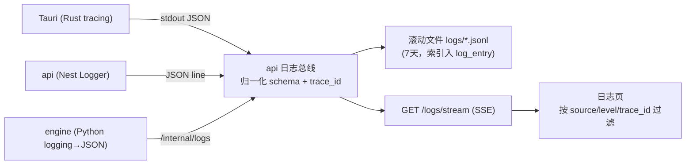

- **统一 schema**:`{ts, level, source, trace_id, span, msg, fields}`。一次用户操作(如「训练」)由 api 生成 `trace_id`,贯穿 api→engine→各子任务,日志页可按 `trace_id` 串起全链路。
- **engine 子进程** 的 stdout/stderr 也被 Tauri Supervisor 捕获并喂给总线,确保崩溃前的最后输出可见。
- 系统状态色(正常绿/错误红)用于日志级别;与盈亏红涨绿跌**解耦**,符合设计约束。

## 10. 配置管理

三层、优先级从低到高:**打包默认(只读)< 用户设置(SQLite `setting` 表)< 环境变量覆盖**。

- **打包默认**:`config.defaults.json` 随包,只读基线(端口段、限流默认、训练超参默认——对应原型 `config.py` 的常量)。
- **用户设置**:写入 SQLite `setting`(主题浅/深、关闭行为、行情刷新 3/5/10/30s、悬浮窗、盘后自动出信号、SMTP、风控参数、provider 优先级)。设置页改一处即生效,经 api 落库并广播。
- **环境变量覆盖**:延续原型 `DASHBOARD_HOST/PORT` 思路,`SINAN_*` 变量在启动期覆盖(便于排障/CI),不改代码、不与更新冲突。
- **机密(token)不进配置体系**,只走钥匙串(§6),从根上避免明文配置泄露。

---

**选型理由与取舍小结**:Tauri 而非 Electron——更小体积、Rust 外壳天然适合做进程监护与钥匙串。双 sidecar 而非单体——Python 引擎不可替代、Node 网关更适合编排与契约,代价是一跳本机网络(可忽略)。SQLite + DuckDB 双存储——事务性元数据与分析性大矩阵职责正交,各取所长,避免「全 SQLite 慢/全 DuckDB 弱事务」。Provider 抽象 + 能力声明 + 降级——把 BYO 与「免费源优雅降级」做成架构而非补丁,新增源零侵入。钥匙串优先 + 加密兜底——在不损失「不明文不上传」前提下覆盖全平台。所有这些都服务一个不可妥协的产品事实:**软件随包零数据/零模型/零 token,一切由用户在自己的电脑上从自己的数据源生成**。

----

关键源文件(供后续章节交叉引用,均为绝对路径,AlphaQuant 原型对应实现):
- `D:\Personal\AlphaQuant\config.py` — 现有全局配置(端口环境变量覆盖、风控参数、CPU 线程、调度时间),正式化为 §10 三层配置 + SQLite `setting`。
- `D:\Personal\AlphaQuant\data\loader.py` — 现有多源降级(腾讯→搜狐→新浪)、CSV 缓存、`get_tradeable_pool` 点位流动性池,正式化为 §5 Provider 注册表 + §3 DuckDB 缓存。
- `D:\Personal\AlphaQuant\data\realtime.py` — 现有新浪/腾讯现价源,成为 `RealtimeProvider`(Capability.REALTIME_QUOTE)。
- `D:\Personal\AlphaQuant\paper_trading\scheduler.py` — 现有 15:30 schedule 调度,迁入 engine `paper/` 由 Tauri 托盘常驻触发。

---

# 量化策略专家

# 量化核心

本章定义司南的量化引擎全链路:数据层 → 因子库 → 表达式引擎 → 多因子合成 → 模型层 → 模拟盘决策链 → 回测引擎 → 诚实评估 → 绩效指标。所有设计贯穿两条铁律:**provider 解耦**(因子层不感知数据来自 Tushare 还是 AkShare)与 **point-in-time 防未来函数**(任一时刻只能看见该时刻之前可获得的数据)。

---

## 1. 数据层

### 1.1 目录与存储布局

数据全部落在用户本机 `~/.sinan/`(Windows 为 `%APPDATA%\sinan\`),由 engine(FastAPI)写入,api(NestJS)只读元数据。

```
~/.sinan/
├── sinan.db                      # SQLite:元数据/策略/持仓/交易/信号/模型/设置/凭据
├── cache/
│   ├── daily/                    # parquet 分区:行情(后复权列另存)
│   │   └── trade_date=YYYYMMDD/part.parquet
│   ├── daily_basic/              # PE/PB/换手/市值/总股本
│   ├── adj_factor/               # 复权因子(point-in-time)
│   ├── fina_indicator/           # 财务指标(含 ann_date/end_date)
│   ├── income|balance|cashflow/  # 财务三表
│   ├── moneyflow_hsgt/           # 北向资金(provider 可缺)
│   ├── index_daily/              # 指数行情(基准/择时)
│   ├── index_weight/             # 指数成分
│   ├── sw_industry/              # 申万行业归属(带生效日期)
│   └── factor/                   # 因子矩阵(宽表,date×code)
│       └── factor_date=YYYYMMDD/part.parquet
└── duckdb/sinan.duck             # DuckDB 视图层,跨 parquet 做 SQL
```

列式层用 **parquet + DuckDB**:parquet 负责落盘与分区裁剪,DuckDB 提供 `SELECT ... FROM read_parquet('cache/daily/**/*.parquet')` 的零拷贝 SQL,因子计算直接在 DuckDB/Polars 里做向量化,不进 pandas 逐行循环。

### 1.2 Provider 抽象层

数据源解耦为统一接口,因子层只依赖 `DataLayer`,不依赖具体 provider。

```python
class Provider(Protocol):
    name: str
    capabilities: set[Capability]          # 见下表
    rate_limit: RateLimitSpec              # 次/分钟、并发
    def get(self, dataset: str, *, codes, start, end, fields) -> pl.DataFrame: ...
    def health_check(self) -> ProviderStatus: ...
```

**Capability 枚举(能力位)** —— 因子层据此优雅降级:

| Capability | 含义 | Tushare(5000) | AkShare | 新浪/腾讯 |
|---|---|---|---|---|
| `PRICE_DAILY` | 日线 OHLCV | ✓ | ✓ | ✗ |
| `PRICE_RT` | 实时现价/昨收 | ✗ | ✓ | ✓ |
| `ADJ_FACTOR` | 复权因子 | ✓ | 部分 | ✗ |
| `VALUATION` | PE/PB/换手/市值(daily_basic) | ✓ | 部分 | ✗ |
| `FINANCIALS` | 三表 + fina_indicator | ✓ | 部分 | ✗ |
| `NORTHBOUND` | 北向 moneyflow_hsgt | ✓ | ✗ | ✗ |
| `INDEX` | 指数行情 + 成分权重 | ✓ | ✓ | ✗ |
| `INDUSTRY` | 申万行业(point-in-time) | ✓ | 部分 | ✗ |
| `FORECAST` | 盈利预测 | ✓ | ✗ | ✗ |

`DataLayer` 维护「dataset → 候选 provider 优先级链」,按能力路由:`daily_basic` 优先 Tushare,缺失回退 AkShare;`PRICE_RT` 走新浪/腾讯。某 dataset 全链不可用时,标记该数据集为 `UNAVAILABLE`,因子层收到 `None` 列后触发降级(见 §3.6)。

### 1.3 限速与拉取调度

Tushare 按积分限频(如 500 次/分钟),用**令牌桶**统一管控,与 provider 解耦:

```python
class RateLimiter:                # 每 provider 一个实例
    capacity: int                 # 桶容量 = rate_limit.per_minute
    refill_per_sec: float         # capacity/60
    # acquire() 阻塞直到拿到令牌;支持优先级(实时刷新 > 批量回填)
```

拉取分两类任务,写入 `task` 表(api 调度,engine 执行):
- **批量回填(backfill)**:首次建缓存,按 `trade_date` 倒序分页拉,断点续传(记录 `cursor`),带进度回调供 onboarding 进度条。
- **增量更新(incremental)**:每日盘后拉当日增量,`upsert` 到 parquet 分区。

失败重试:指数退避(1s/2s/4s,最多 5 次),429/限频错误自动让令牌桶降速。所有拉取记 `data_sync_log`(provider/dataset/区间/行数/耗时/状态)。

### 1.4 复权对齐(critical)

**原始价不复权存储,复权在计算时动态施加**,避免历史复权值随新除权变化导致"昨天的因子今天变了"。

- `daily` 存原始 `open/high/low/close/vol/amount` + 当日 `adj_factor`。
- **后复权价**(用于因子/收益率,连续不跳空):`hfq_close = close × adj_factor`(adj_factor 为 Tushare 累计复权因子,以最早日为基)。
- **前复权价**(仅用于 K 线展示):`qfq_close = close × adj_factor / adj_factor_latest`,`adj_factor_latest` 随时间变,**绝不入因子**。
- 收益率统一用后复权:`ret = hfq_close_t / hfq_close_{t-1} - 1`。
- AkShare 无 adj_factor 时:用其自带 `qfq`/`hfq` 列直接对齐,或以「复权收益率序列」反推等效因子,封装在 provider 内,因子层无感。

### 1.5 Point-in-time 防未来函数(数据层根除)

未来函数在 AlphaQuant 是首要翻车点,数据层从存储结构上根除:

1. **财务数据带公告日**:`fina_indicator`/三表均存 `end_date`(报告期)与 `ann_date`(公告日)。因子在交易日 `T` 取财务字段时,**只能用 `ann_date ≤ T` 的最新一期**,而非 `end_date ≤ T`。一季报常 4 月底才公告,用 end_date 即泄露 1 个月未来。

```sql
-- T 日可见的最新 ROE(point-in-time 正确写法)
SELECT code, roe FROM fina_indicator
WHERE ann_date <= :T
QUALIFY row_number() OVER (PARTITION BY code ORDER BY end_date DESC, ann_date DESC) = 1
```

2. **行业归属带生效日**:`sw_industry` 存 `in_date`/`out_date`,行业中性化时取 `T` 日实际所属,不用最新归属。
3. **指数成分带快照**:`index_weight` 按月存,回测取 `≤T` 的最近快照,避免幸存者偏差。
4. **信号滞后 1 日**:因子用 `T` 日收盘数据,信号 `T` 日盘后生成,`T+1` 开盘成交(见 §6)。
5. **退市/停牌**:停牌日不产生信号、不计入调仓;退市股保留在历史(防幸存者偏差),仅在其存续期参与。

数据层提供统一入口 `data.asof(dataset, fields, asof_date)`,所有上层取数走它,杜绝裸读 parquet。

---

## 2. 因子库

每个因子是一个纯函数 `f(panel: FactorContext) -> pl.Series`(index=code),声明所需 `datasets/fields` 与依赖 `Capability`。因子矩阵按 `factor_date` 落 `cache/factor/`。下表逐因子给字段来源与公式(`_t` 为 point-in-time 取数)。

### 2.1 价值(Value)

| 因子 | 字段来源 | 公式 |
|---|---|---|
| EP | daily_basic.pe_ttm | `1 / pe_ttm`(pe≤0 置 NaN) |
| BP | daily_basic.pb | `1 / pb` |
| SP | daily_basic.ps_ttm | `1 / ps_ttm` |
| CFP | cashflow.n_cashflow_act_ttm / daily_basic.total_mv | 经营现金流TTM / 总市值 |
| DP | daily_basic.dv_ttm | 股息率 TTM |

### 2.2 质量(Quality)

| 因子 | 字段来源 | 公式 |
|---|---|---|
| ROE | fina_indicator.roe | 净资产收益率(ann_date PIT) |
| ROA | fina_indicator.roa | 总资产收益率 |
| GrossMargin | fina_indicator.grossprofit_margin | 毛利率 |
| Accrual(应计,反向) | (净利润−经营现金流)/总资产 | 越低质量越高,取负 |
| Leverage | balance.total_liab / total_assets | 资产负债率(反向) |
| AssetTurnover | fina_indicator.assets_turn | 资产周转率 |

### 2.3 成长(Growth)

| 因子 | 字段来源 | 公式 |
|---|---|---|
| NetProfitYoY | fina_indicator.netprofit_yoy | 归母净利同比 |
| RevenueYoY | fina_indicator.or_yoy | 营收同比 |
| ROEGrowth | fina_indicator.roe 同比差 | `roe_t − roe_{t-4q}` |
| SUE | 实际EPS与预测差 / 标准差 | 盈余惊喜(需 FORECAST) |

### 2.4 规模(Size)

| 因子 | 字段来源 | 公式 |
|---|---|---|
| LnMktCap | daily_basic.total_mv | `ln(total_mv)`(A股小市值历史有效,作风格因子需中性化) |
| LnCircMktCap | daily_basic.circ_mv | `ln(circ_mv)` |

### 2.5 动量 / 反转(Momentum / Reversal)

| 因子 | 字段来源 | 公式 |
|---|---|---|
| Mom_20 | hfq_close | `close_t/close_{t-20}−1`(短期A股偏反转,常取负) |
| Mom_60 | hfq_close | 60日动量 |
| Reversal_5 | hfq_close | `−(close_t/close_{t-5}−1)` |
| Volatility_20(反向) | daily ret | 20日收益标准差,越低越优 |
| Turnover_20(反向) | daily_basic.turnover_rate | 20日均换手,过高拥挤,取负 |

### 2.6 北向聪明钱(Northbound)— 核心 alpha 来源

> AlphaQuant 教训:**真正的超额来自基本面 + 北向,不是价量深度学习**。北向因子优先级最高,但 provider 可能缺失(见 §3.6 降级)。

| 因子 | 字段来源 | 公式 |
|---|---|---|
| NorthHoldPct | hk_hold.ratio(陆股通持股占比) | 当前持股占流通比 |
| NorthHoldChg_5 | hk_hold.ratio | `ratio_t − ratio_{t-5}`(增持斜率) |
| NorthHoldChg_20 | hk_hold.ratio | 20日持股占比变动 |
| NorthInflowMomentum | moneyflow_hsgt + 个股 | 行业/个股层北向净流入动量 |

---

## 3. 自定义因子 / 指标表达式引擎

让用户在「指标」页用受限表达式自定义因子,**安全沙箱**,绝不 `eval` 原生 Python。

### 3.1 架构

表达式 → 词法/语法解析(自建 AST,基于 `ast.parse` 白名单遍历)→ 编译为对 Polars/numpy 向量算子的调用 → 在 `FactorContext` 上求值。禁用属性访问、`__`、import、调用未白名单函数、文件/网络/IO。

### 3.2 可用字段(命名空间)

向用户暴露 PIT 安全的字段别名,如:`close, open, high, low, vol, amount`(后复权)、`pe_ttm, pb, ps_ttm, total_mv, circ_mv, turnover_rate`、`roe, roa, netprofit_yoy, grossprofit_margin`、`north_hold_pct`、`industry`、已注册的内置因子名(可组合)。

### 3.3 白名单算子

```
横截面:  rank(x), zscore(x), winsor(x, n=3), neutralize(x, industry), quantile(x,q)
时序:    ts_mean(x,d), ts_std(x,d), ts_delta(x,d), ts_delay(x,d), ts_rank(x,d),
         ts_corr(x,y,d), ts_sum(x,d), ts_max/ts_min(x,d), ema(x,d)
基础:    + - * / , abs, log, sign, max, min, where(cond,a,b)
技术指标: MA(d), EMA(d), RSI(d), MACD(), BOLL(d,k), ATR(d), KDJ()  -- 预编译
```

时序算子内部强制 **`ts_delay` 语义对齐 PIT**:`ts_delta(x, d)` = `x_t − x_{t-d}`,不引用未来。

### 3.4 校验闸(防未来函数自动检测)

注册自定义因子时,引擎做静态检查 + 随机日穿越测试:对历史某日 `T` 求值时,**截断 `>T` 的数据再求值,比对结果是否一致**;不一致 → 判定含未来函数,拒绝注册并提示。

### 3.5 安全沙箱细则

- 解析后 AST 节点类型白名单:`Expression/BinOp/UnaryOp/Call(仅白名单名)/Name(仅白名单字段)/Constant/Compare`。
- 执行超时(默认 5s)、行数/内存上限;异常隔离不崩主进程。
- 用户因子存 `custom_factor` 表(见 §10),版本化。

### 3.6 Provider 优雅降级(因子层)

因子声明 `required_capabilities`。当所需 capability 缺失:

| 缺失能力 | 降级策略 |
|---|---|
| NORTHBOUND | 北向因子整组置空;合成时**重分配其权重至质量+价值组**,并在信号详情标注「北向因子不可用,已降级为基本面打分」 |
| FINANCIALS | 质量/成长组停用,退化为「价值(估值)+ 量价反转」模式,UI 红字提示 alpha 显著降低(对应 AlphaQuant「免费价量≈无 alpha」教训,明确告知预期) |
| VALUATION | 价值组停用,仅量价 + 北向(若有) |
| INDUSTRY | 行业中性化跳过,改用全市场中性(标注) |

降级不报错、不静默:每次合成产出 `factor_coverage` 报告(各组实际生效因子数 / 应有数),写入信号详情与日志。

---

## 4. 多因子打分合成

单因子 → 横截面处理 → 加权合成总分,逐步如下(全在横截面 = 同一交易日内做):


1. **去极值**:MAD 法,`x = clip(x, median ± 3×1.4826×MAD)`(比 ±3σ 抗厚尾)。
2. **标准化**:横截面 zscore。
3. **行业中性化**:`x_resid = x − OLS(x ~ 行业哑变量)` 的拟合值,即残差;消除行业系统性偏差。行业用 PIT 申万一级。
4. **市值中性化(可选)**:再对 `ln(mktcap)` 回归取残差,剥离规模暴露。
5. **缺失填补**:同行业中位数填补;整组缺失走 §3.6 降级。
6. **方向统一**:反向因子(估值倍数、波动、换手、杠杆、应计)取负,使「大=好」。
7. **合成权重**:
   - **IC 加权(默认)**:用滚动窗口(如过去 252 日,**只用样本内**)各因子 IC 均值 / IC 标准差(即 ICIR)作权重,`w_i = ICIR_i / Σ|ICIR_j|`。IC 计算用 RankIC(因子值与未来 N 日收益的 Spearman 相关)。
   - **等权 / 分组权重**:用户可在模型配置里改为大类等权(价值/质量/成长/北向各 25%)。
   - **拥挤惩罚**:对换手率高、近期 IC 衰减快的因子降权(AlphaQuant 因子拥挤/衰减教训)。
8. **总分**:合成后再 percentile 化为 `[0,1]`,作为选股排序依据。

合成输出落 `cache/factor/` 宽表与 `factor_score` 表(code/date/score/各分项)。

---

## 5. 模型层

**默认 = 因子打分(线性/IC 加权),ML 为可选叠加层**,严格对应教训 2(不押注价量深度学习)。

### 5.1 三档模型模式(用户在模型页选)

| 模式 | 说明 | 适用 |
|---|---|---|
| `factor_score`(默认) | §4 的 IC 加权多因子总分,**无 ML**,可解释、稳健 | 推荐默认 |
| `ml_overlay` | 因子作为特征,训练 LightGBM/Logistic 预测「未来 N 日是否跑赢行业中位」(分类)或超额收益(回归),输出概率叠加到因子分 | 进阶 |
| `ensemble` | `0.5×因子分 + 0.5×ML概率`,加权可调 | 进阶 |

### 5.2 ML 细则

- **标签**:`y = 1[ 未来N日个股超额收益 > 行业中位 ]`(N 默认 10 交易日),超额 = 个股收益 − 沪深300收益。回归标签为未来 N 日超额收益。
- **特征**:§2 全部因子(已中性化标准化),禁用任何含未来信息字段。
- **模型**:LightGBM(CPU 优先,自动探测 GPU)/ Logistic / 浅 MLP。早停、L2 正则、特征重要性输出。
- **训练产物**:进度回调(epoch/iteration、train/val loss、AUC 曲线)推到 model 页;版本化存 `model` 表 + 权重文件 `~/.sinan/models/<version>/`。
- **诚实样本外**:训练严格走 §7 时序切分 + walk-forward,**报告的 AUC/IC 一律是样本外**;UI 同时显示「样本内 vs 样本外」对比,样本外大幅低于样本内时红字警告过拟合。
- **现实预期锚定**:模型页固定展示教训卡片——「目标 IR 0.5–1.0,长期略跑赢沪深300,非暴富;纸面前向验证数月再谈真钱」。

---

## 6. 模拟盘引擎决策链

盘后自动执行,完整决策链(任一闸不过则跳过/调整),**记账到 SQLite**:

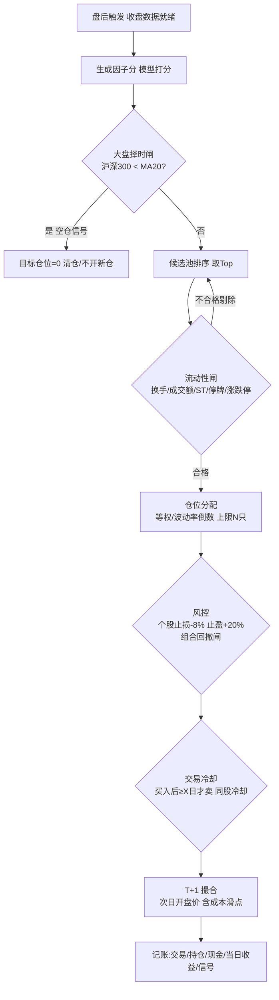

### 6.1 各闸细则(AlphaQuant「风控纪律 > 模型」教训落地)

1. **大盘择时闸**:基准沪深300 收盘 `< MA20` → 全局空仓/只减不增。这是回撤控制的最强单一开关。
2. **候选池**:剔除上市 < 60 日、ST/*ST、停牌、当日一字涨跌停(无法成交)、北向/财务关键字段缺失过多者。
3. **流动性闸**:近 20 日日均成交额 < 阈值(如 5000 万)剔除;**动态流动性池**随市场调整阈值。
4. **仓位**:`max_positions = N`(默认 5,可配);权重 = 等权 或 波动率倒数(`1/σ` 归一);单票上限(如 30%)。
5. **止损/止盈**:个股 `-8%` 止损、`+20%` 止盈(可配);组合层最大回撤超阈值降仓。
6. **T+1**:买入次日才可卖;信号 `T` 日盘后出,`T+1` 开盘价成交(防未来函数 + 贴近现实)。
7. **买卖冷却**:买入后至少持有 X 日(默认 2)才允许卖出;同一股卖出后冷却 M 日不再买入(抑制来回打脸)。
8. **交易成本**(回测与模拟盘一致):印花税 0.05%(仅卖出,2023 后单边)+ 佣金双边万 2.5(最低 5 元)+ 过户费 + **冲击成本/滑点**(按成交额 bps 或开盘价偏移)。
9. **记账**:每笔写 `sim_trade`,持仓更新 `sim_position`,现金/净值更新 `sim_account`,当日收益写 `sim_daily_return`,信号写 `signal`。个人持仓为独立两套表(`user_*`),手动维护、与模拟盘分开展示。

### 6.2 当日收益计算(个人 + 模型分别)

盘中/盘后用实时源(新浪/腾讯)现价对持仓估值:`当日收益 = Σ(持仓量 × (现价 − 昨收))`;模型盘与个人盘各算各的,分别展示。无实时源时退化为收盘价(标注延迟)。

---

## 7. 回测引擎

事件驱动 + 向量化混合:调仓日按因子分选股,**逐日撮合**(T+1、开盘价、成本、滑点),日频更新净值。

### 7.1 无未来函数(回测层强约束)

- 回测**只测训练截止日之后**的区间(`backtest_start > train_end`),引擎硬校验,重叠则报错拒跑。
- 每个交易日只喂 `data.asof(..., T)` 的 PIT 数据。
- 信号 `T` 日生成,`T+1` 开盘成交;收益用后复权。
- 因子 IC / 权重若来自滚动估计,**窗口只回看不前瞻**。

### 7.2 成本与滑点

每笔成交价 = 开盘价 ×(1 ± 滑点 bps)+ 固定/比例成本;卖出额外印花税。冲击成本可按 `成交额/日均成交额` 放大(下单越大滑点越高),对应因子拥挤的实盘衰减。

### 7.3 基准

默认沪深300(`index_daily`),计算超额、跟踪误差、IR。可切中证500/中证全指。

---

## 8. 诚实评估

> AlphaQuant 第一教训:**诚实评估第一**。这是质量闸,不是装饰。

### 8.1 时序切分 + Purge

按日期分位切 train/valid/test(如 60/20/20),**绝不随机打散**。在 train 与 valid/test 边界做 **purge + embargo**:剔除标签窗口跨越边界的样本(标签看未来 N 日,边界前 N 日样本会泄露),embargo 再额外隔离若干日,根除信息泄漏。

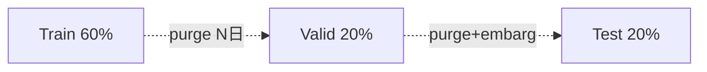

### 8.2 Walk-forward(跨牛熊)

滚动窗口:训练窗 → 验证窗 → 前移,覆盖 2015 牛、2018 熊、2019–21、2022–24 等多周期,报告**每个 fold 的样本外**指标与稳定性(IC 均值/标准差跨 fold)。只在单一行情验证视为不通过。

### 8.3 防过拟合红线

- 报告指标一律样本外;样本内/外差距过大红字警告。
- 因子/超参数搜索次数记账,提示「多重检验」风险(搜得越多越易假阳)。
- 前向纸面验证:模拟盘跑数月真实盘后信号,与回测对齐后才提示「可考虑真钱」(仍不自动下单)。

---

## 9. 绩效指标

回测/模拟盘/walk-forward 统一指标口径(日频),展示在总览/回测/模型页:

| 指标 | 公式 |
|---|---|
| 年化收益 | `(1+总收益)^(252/天数) − 1` |
| 年化超额 | 组合年化 − 基准年化 |
| 最大回撤 | `max_t( (峰值−净值_t)/峰值 )` |
| 夏普 | `(年化收益 − rf) / 年化波动`,rf 默认 0 |
| 信息比率 IR | `年化超额 / 跟踪误差(超额收益年化标准差)`,目标 0.5–1.0 |
| 跟踪误差 | 超额日收益标准差 × √252 |
| 换手率 | `Σ|权重变动| / 2`(双边,衡量成本敏感) |
| 胜率 | 盈利交易数 / 总交易数 |
| 盈亏比 | 平均盈利 / 平均亏损 |
| Calmar | 年化收益 / 最大回撤 |
| RankIC / ICIR | 因子分与未来收益 Spearman;ICIR=IC均值/IC标准差 |

绩效结果存 `backtest_result` / `model_metric`,前端 A 股配色:盈红亏绿,系统状态色(正常绿/错误红)与盈亏色解耦。

---

## 10. 关键表结构(SQLite 元数据,行情/因子在 parquet)

```sql
-- 复权对齐用,原始价 + 因子分离
CREATE TABLE data_sync_log(id INTEGER PK, provider TEXT, dataset TEXT,
  start_date TEXT, end_date TEXT, rows INT, elapsed_ms INT, status TEXT, ts TEXT);

CREATE TABLE custom_factor(id INTEGER PK, name TEXT UNIQUE, expr TEXT,
  required_caps TEXT, direction INT, version INT, pit_checked INT, created_at TEXT);

CREATE TABLE factor_score(code TEXT, trade_date TEXT, model_id INT,
  score REAL, value_s REAL, quality_s REAL, growth_s REAL, mom_s REAL,
  north_s REAL, coverage REAL, PRIMARY KEY(code,trade_date,model_id));

CREATE TABLE model(id INTEGER PK, name TEXT, mode TEXT, version INT,
  train_end TEXT, params TEXT, oos_ic REAL, oos_auc REAL, is_ic REAL,
  weights_path TEXT, created_at TEXT);

CREATE TABLE signal(id INTEGER PK, trade_date TEXT, code TEXT, model_id INT,
  action TEXT, score REAL, reason TEXT, coverage REAL);  -- reason 记降级/被闸拦截原因

-- 模拟盘三件套(与个人持仓 user_* 完全分离)
CREATE TABLE sim_account(date TEXT PK, cash REAL, market_value REAL, nav REAL,
  daily_return REAL, drawdown REAL);
CREATE TABLE sim_position(code TEXT, name TEXT, qty INT, cost REAL, open_date TEXT,
  cooldown_until TEXT, PRIMARY KEY(code));
CREATE TABLE sim_trade(id INTEGER PK, trade_date TEXT, code TEXT, side TEXT,
  price REAL, qty INT, fee REAL, tax REAL, slippage REAL, reason TEXT);
CREATE TABLE sim_daily_return(date TEXT PK, model_ret REAL, benchmark_ret REAL, excess REAL);

CREATE TABLE backtest_result(id INTEGER PK, model_id INT, start TEXT, end TEXT,
  annual REAL, excess REAL, mdd REAL, sharpe REAL, ir REAL, turnover REAL,
  win_rate REAL, calmar REAL, params TEXT, created_at TEXT);
```

---

## 11. Engine 端点(FastAPI,127.0.0.1:59915)

| 方法 | 端点 | 说明 |
|---|---|---|
| POST | `/data/backfill` | 启动批量回填,返回 task_id;SSE 进度 |
| POST | `/data/sync` | 盘后增量更新 |
| GET | `/data/coverage` | 各 dataset/provider 可用性(能力位)报告 |
| POST | `/factor/compute` | 计算指定日因子矩阵 |
| POST | `/factor/custom/validate` | 校验自定义表达式(含 PIT 穿越测试) |
| POST | `/factor/score` | 多因子合成打分(含降级报告) |
| POST | `/model/train` | 训练,SSE 推 loss/AUC/进度 |
| GET | `/model/{id}/metrics` | 样本内外 IC/AUC 对比 |
| POST | `/backtest/run` | 回测(硬校验 backtest_start>train_end) |
| GET | `/backtest/{id}` | 绩效指标 + 净值曲线 |
| POST | `/sim/run-eod` | 盘后跑模拟盘决策链,出信号 + 记账 |
| GET | `/sim/portfolio` | 模拟盘持仓 + 当日收益 |
| GET | `/quote/realtime` | 实时现价(新浪/腾讯),供当日收益 |

api 网关(NestJS,59914)只做任务编排、鉴权(本地单用户)、元数据 REST 与 SSE 透传;所有重计算在 engine。

---

# 机器学习/训练专家

# 模型训练流水线(Training Pipeline)

> 本章定义司南本机训练系统的端到端流程:从因子矩阵到样本、标签构造、严格时序切分、walk-forward 滚动重训、集成、模型注册与版本管理、训练任务编排与实时曲线推送、推理部署到 engine、模型诊断与影子对比,以及诚实期望管理。所有计算在用户本机完成,凭据与数据永不离开本机。

---

## 0. 总体数据流

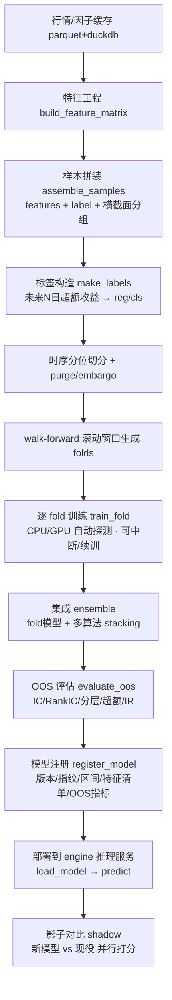

冷启动顺序约束:`缓存就绪(build_cache)` 是训练前置条件。训练任务提交时若检测到所需区间缓存缺失,任务自动进入 `WAIT_CACHE` 子阶段,先触发增量缓存构建再继续。

---

## 1. 特征工程:因子矩阵 → 样本

### 1.1 输入:因子矩阵契约

因子矩阵是「长表」(long format),由因子计算模块产出,落地为 parquet,duckdb 建外部视图查询。主键 `(trade_date, ts_code)`。

| 列 | 类型 | 说明 |
|---|---|---|
| `trade_date` | DATE | 交易日(YYYY-MM-DD) |
| `ts_code` | TEXT | 标的代码(如 `600519.SH`) |
| `f_*` | DOUBLE | 因子列,命名前缀 `f_`,如 `f_pe_ttm`、`f_pb`、`f_turnover`、`f_north_net5`、`f_roe`、`f_mom20`、`f_swing20` |
| `industry_sw1` | TEXT | 申万一级行业(用于中性化/分组) |
| `is_st` | BOOL | 是否 ST(样本剔除) |
| `is_suspended` | BOOL | 当日停牌(样本剔除) |
| `amount_20d` | DOUBLE | 20 日均成交额(流动性池过滤) |
| `list_days` | INT | 上市天数(剔除次新) |

### 1.2 横截面预处理(每个 `trade_date` 内独立做,严禁跨日泄漏)

按交易日分组,对每个因子列依次执行:

1. **去极值**:MAD 法,中位数 ± 5×MAD 截断(winsorize),或分位 1%/99% 截断(可配)。
2. **缺失填充**:行业内中位数填充;行业仍缺则全市场中位数;记录缺失率 `nan_rate`,单因子缺失率 > 50% 当日该因子置零并打标。
3. **标准化**:横截面 z-score,`z = (x - mean) / std`(std=0 时置 0)。
4. **行业市值中性化(可选)**:对 `f` 做 `f ~ industry_dummies + ln(mktcap)` 回归,取残差。回归仅用当日截面数据,不引入未来。

> 关键纪律:所有预处理统计量(中位数、mean、std、MAD)**只在当日截面内计算**,绝不使用全样本统计量做标准化(那是经典未来函数)。

### 1.3 样本过滤(流动性 / 可交易性闸门)

逐日剔除:`is_st=True` ∪ `is_suspended=True` ∪ `list_days < 120` ∪ `amount_20d < 流动性阈值(默认2000万)`。剔除发生在标签计算**之后**,以保证标签窗口内的可交易性一致。

### 1.4 输出:样本表 `samples`

落地为 parquet(训练期物化到 `cache/train/<run_id>/samples.parquet`),schema:

| 列 | 类型 | 说明 |
|---|---|---|
| `trade_date` | DATE | 样本日(特征观测日) |
| `ts_code` | TEXT | 标的 |
| `feat` | DOUBLE[] | 定长特征向量(顺序由 `feature_list` 固定) |
| `y_reg` | DOUBLE | 回归标签(未来 N 日超额收益) |
| `y_cls` | INT | 分类标签(横截面分位) |
| `weight` | DOUBLE | 样本权重(见 §2.4) |
| `group_date` | INT | 切分用日期分组键(yyyymmdd 整数) |
| `industry_sw1` | TEXT | 分组评估用 |

---

## 2. 标签构造(未来 N 日超额收益)

### 2.1 前向收益

观测日 `t`,持有期 `N`(默认 N=5,可配 {1,3,5,10,20})。**信号滞后 1 日**:实际建仓在 `t+1` 开盘,故前向收益从 `t+1` 算到 `t+1+N`:

$$
r_{i}(t) = \frac{P^{\text{open}}_{i}(t{+}1{+}N)}{P^{\text{open}}_{i}(t{+}1)} - 1
$$

价格用前复权(`adj_factor`)。开盘价口径模拟真实可成交点;若数据仅有收盘,退化为 `t+1` 收盘到 `t+1+N` 收盘并在元数据标注口径降级。

### 2.2 超额收益(剥离 beta,这是 alpha 的诚实定义)

基准默认沪深300。超额 = 个股前向收益 − 基准同期前向收益:

$$
\alpha_{i}(t) = r_{i}(t) - r_{\text{bench}}(t)
$$

可选行业中性超额:减去个股所属申万一级行业同期等权收益,衡量行业内选股能力。

### 2.3 两种任务标签

- **回归** `y_reg = α_i(t)`(可选对 α 做横截面 rank → [0,1] 归一,降低厚尾影响,推荐 `rank_normalize`)。
- **分类** `y_cls`:对当日截面 α 排序分位。
  - 二分类:Top 30% = 1,Bottom 30% = 0,中间 40% **丢弃**(降噪,聚焦头尾)。
  - 三/五分类:按 quantile 分桶,默认用于分层回测,不用于主训练。

### 2.4 样本权重

`weight = w_time × w_liq`:
- `w_time`:时间衰减,`w_time = 0.5^((T_max - t)/halflife)`,默认 halflife=252 交易日,让近期样本更重。
- `w_liq`:流动性权重,`min(1, amount_20d / 1e8)`,弱化微盘噪声。

### 2.5 标签泄漏自检(硬约束)

`assert max(label_end_date) ≤ feature_obs_date 不成立时报错`:任何样本的标签窗口结束日 `t+1+N` 必须严格 ≤ 训练截止日;否则该样本剔除并计数。该断言写入流水线,违反即 fail-fast。

---

## 3. 训练/验证切分:时序分位 + purge(严禁随机切分)

### 3.1 为什么严禁随机切分

随机 K-fold 会把同一时间段的样本分散到训练与验证,横截面因子在相邻日高度自相关,等于变相用未来信息,OOS 严重虚高。**唯一合法切分维度是日期(`group_date`)。**

### 3.2 时序分位切分

按 `group_date` 升序,取日期分位点切训练/验证/测试,例:`[0, 0.7)` 训练、`[0.7, 0.85)` 验证、`[0.85, 1.0]` 测试。切分作用在**唯一日期序列**上,再回填到样本,保证同一天的样本不跨集。

### 3.3 Purge + Embargo(边界净化)

标签持有期 N 会让训练集末尾样本的标签窗口与验证集开头重叠 → 泄漏。在每个边界:

- **Purge**:删除训练集中标签窗口 `[t+1, t+1+N]` 与验证集日期范围相交的样本。
- **Embargo**:验证集起点后再额外空出 `embargo = N + 1` 个交易日(吸收信号滞后+持有期),这段时间样本两边都不用。

```mermaid
gantt
    dateFormat X
    axisFormat %s
    section 时间轴
    Train            :0, 70
    Purge(剔除N日)    :crit, 70, 76
    Embargo(N+1)     :active, 76, 82
    Valid            :82, 100
```

---

## 4. Walk-Forward 滚动重训

### 4.1 原理

固定切分只测一段,无法跨牛熊。Walk-forward 用滚动窗口生成多个 `(train, valid, test)` fold,逐窗训练、在紧邻的未来段做 OOS,把所有 fold 的 OOS 拼起来才是诚实的样本外曲线。

### 4.2 两种窗口模式

- **Expanding(扩张)**:训练起点固定,终点滚动后移。默认,数据利用充分。
- **Rolling(滚动固定窗)**:训练窗长度固定(如 750 交易日),整体后移,适应市场结构变化。

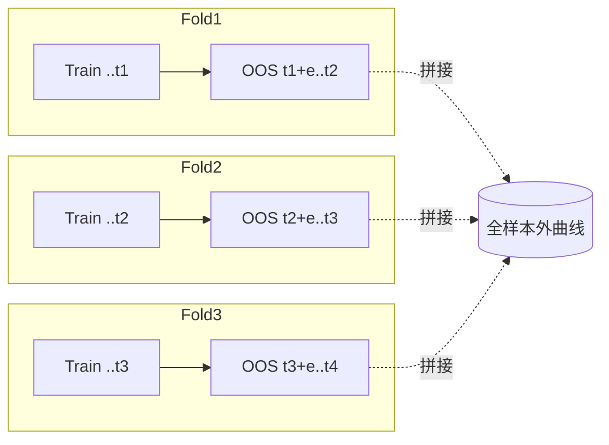

### 4.3 参数(训练配置 `walk_forward`)

| 参数 | 默认 | 说明 |
|---|---|---|
| `mode` | expanding | expanding / rolling |
| `train_min_days` | 504 | 首个 fold 最小训练交易日(约2年) |
| `step_days` | 63 | 每次后移步长(约1季度) |
| `test_days` | 63 | 每 fold OOS 长度 |
| `embargo_days` | N+1 | 净化天数 |
| `purge` | true | 是否启用 purge |

每个 fold 内部仍做 §3 的 train/valid 切分 + purge,用 valid 早停;`test_days` 段是该 fold 的纯 OOS,训练全程不可见。

---

## 5. 集成(Ensemble)

三层可叠加,默认开第 1+2 层:

1. **Fold 平均**:每个 walk-forward fold 训出的模型,在推理时对各自适用区间外亦可参与,最终用最近 K 个 fold 模型预测取均值(或时间加权),降低单段过拟合。
2. **多算法横向集成**:同一 fold 内训练 `LightGBM`(主)、`XGBoost`、`线性/ElasticNet`(基本面打分基线)、可选 `MLP`,对预测分做 rank 后加权平均(权重由 valid 段 RankIC 决定,负 IC 模型权重置 0)。
3. **Stacking(可选,谨慎)**:用 valid 段 OOF 预测训练一个浅层 meta 模型(Ridge)。仅在 OOF 上拟合,避免泄漏;默认关闭,因易过拟合。

> 与「免费价量≈无 alpha」教训呼应:线性 ElasticNet 基本面打分作为**永远在场的基线**,ML 模型必须在 OOS 上显著超过该基线才被采纳,否则注册时打 `weak` 标记并降权。

---

## 6. 防过拟合 & 防未来函数:工程约束清单

每次训练启动前由 `preflight_checks()` 自动执行,任一硬约束失败则 fail-fast、任务标 `FAILED` 并在日志页给出明确中文原因。

### 6.1 防未来函数(硬约束,违反即 fail)

- [ ] 横截面预处理统计量仅用当日截面(无全样本 mean/std)。
- [ ] 标签前向窗口结束日 ≤ 训练截止日(§2.5 断言)。
- [ ] 信号滞后 1 日已体现在标签起点 `t+1`。
- [ ] 切分仅按 `group_date`,无随机 shuffle;同一天样本不跨集。
- [ ] Purge + Embargo 已应用于每个边界。
- [ ] 复权因子 `adj_factor` 截止训练日,无未来复权回填。
- [ ] OOS 测试段日期严格 > 训练截止日。
- [ ] 特征中不含任何由未来计算的列(自动扫描 `f_*` 生成依赖图,标注 lookahead=0)。

### 6.2 防过拟合(软约束,违反则告警+降权,不 fail)

- [ ] 特征数 / 有效样本数 < 上限(默认 1/50),否则告警特征过多。
- [ ] LightGBM 强正则:`num_leaves≤31`、`min_data_in_leaf≥200`、`feature_fraction=0.7`、`bagging_fraction=0.7`、`lambda_l1/l2>0`、`early_stopping_rounds=100`。
- [ ] 特征相关性剪枝:|corr|>0.95 的因子对保留信息量高者。
- [ ] 跨 fold OOS 指标方差检查:fold 间 RankIC 标准差过大(>均值)标记不稳定。
- [ ] 训练/验证指标 gap 检查:train AUC − valid AUC > 0.15 标记过拟合。

---

## 7. 模型注册与版本管理

### 7.1 目录结构(本机)

```
<app_data>/sinan/models/
  <model_id>/                      # 逻辑模型(策略)
    <version>/                     # 如 v20260608_153012
      model.txt | model.pkl        # 序列化(LightGBM原生/joblib)
      meta.json                    # 版本元数据(下表)
      feature_list.json            # 有序特征清单
      oos_metrics.json             # OOS 指标
      curves.parquet               # loss/AUC/IC 训练曲线
      fold_manifest.json           # 各 fold 区间与子模型指纹
      preprocess.json              # 预处理参数(去极值/中性化配置)
```

### 7.2 SQLite 表(元数据)

`model_registry`:

| 字段 | 类型 | 说明 |
|---|---|---|
| `id` | TEXT PK | 版本唯一 id(=fingerprint 前缀) |
| `model_id` | TEXT | 逻辑模型名 |
| `version` | TEXT | 人类可读版本号 |
| `fingerprint` | TEXT | 指纹(见 §7.3) |
| `algo` | TEXT | lightgbm/ensemble/elasticnet |
| `task` | TEXT | reg / cls |
| `train_start` | DATE | 训练区间起 |
| `train_end` | DATE | 训练截止日(OOS 必须晚于此) |
| `label_n` | INT | 持有期 N |
| `feature_hash` | TEXT | 特征清单哈希 |
| `n_features` | INT | 特征数 |
| `n_samples` | INT | 有效样本数 |
| `oos_rank_ic` | DOUBLE | OOS RankIC 均值 |
| `oos_ir` | DOUBLE | OOS IR(IC_mean/IC_std×√频率) |
| `oos_auc` | DOUBLE | OOS AUC(分类时) |
| `oos_top_excess` | DOUBLE | Top 分层年化超额 |
| `oos_max_dd` | DOUBLE | 分层多头回撤 |
| `vs_baseline` | DOUBLE | 相对 ElasticNet 基线的 RankIC 增量 |
| `status` | TEXT | draft/staging/champion/shadow/retired/weak |
| `created_at` | DATETIME | 训练完成时间 |
| `engine_loaded` | BOOL | 是否已部署到 engine |

状态机:`draft → staging →(影子对比通过)→ champion`;旧 champion 转 `retired`;未超基线打 `weak`。

### 7.3 指纹(fingerprint)

`sha256` 串联:`train_start|train_end|label_n|feature_hash|algo|hyperparams_json|preprocess_json|code_version`。同输入同代码 → 同指纹,保证可复现与去重(重复训练直接复用)。

### 7.4 OOS 指标契约 `oos_metrics.json`

```json
{
  "rank_ic_mean": 0.041,
  "rank_ic_std": 0.11,
  "rank_ic_ir": 0.62,
  "auc": 0.523,
  "top_decile_excess_annual": 0.058,
  "long_short_annual": 0.092,
  "long_only_max_dd": 0.14,
  "turnover": 0.35,
  "by_fold": [{"fold":1,"rank_ic":0.05,"start":"2022-01-04","end":"2022-04-01"}],
  "by_industry": {"银行":0.02,"医药":0.06},
  "baseline_rank_ic": 0.030,
  "vs_baseline": 0.011,
  "verdict": "acceptable"
}
```

`verdict ∈ {strong, acceptable, weak, reject}`,判据见 §11,**只看 OOS,不看 AUC 绝对值**。

---

## 8. 训练任务编排(后台 + 实时推送)

### 8.1 任务生命周期与子阶段

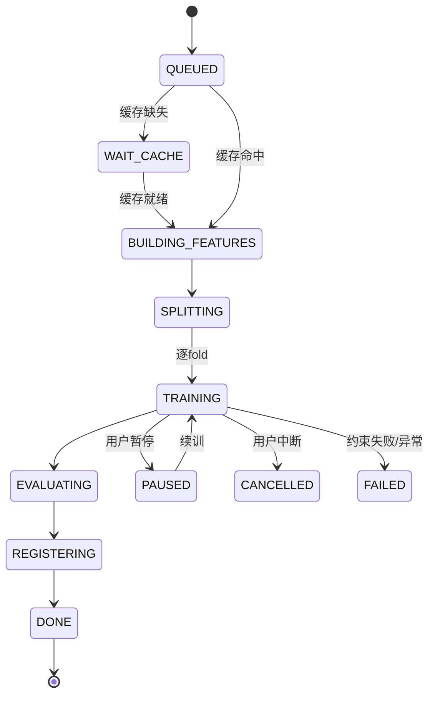

### 8.2 编排端点(api 网关 NestJS,127.0.0.1)

| 方法 | 路径 | 说明 |
|---|---|---|
| POST | `/api/train/jobs` | 提交训练任务,body=训练配置(§10),返回 `job_id` |
| GET | `/api/train/jobs` | 任务列表(状态/进度/指标摘要) |
| GET | `/api/train/jobs/{job_id}` | 任务详情(配置/当前阶段/曲线快照) |
| POST | `/api/train/jobs/{job_id}/pause` | 暂停(写 checkpoint) |
| POST | `/api/train/jobs/{job_id}/resume` | 续训(从 checkpoint) |
| POST | `/api/train/jobs/{job_id}/cancel` | 中断 |
| GET | `/api/train/jobs/{job_id}/logs` | 训练日志(分页) |
| GET | `/api/train/stream/{job_id}` | **SSE/WebSocket** 实时曲线与进度 |
| POST | `/api/train/jobs/{job_id}/register` | 评估通过后注册为版本 |

实际训练在 engine(FastAPI)执行,api 网关转发并代理 SSE。engine 内部端点:`POST /engine/train/run`、`GET /engine/train/progress/{job_id}`。

### 8.3 实时推送消息契约(SSE event)

```json
{
  "job_id": "job_abc",
  "phase": "TRAINING",
  "fold": 2, "total_folds": 6,
  "epoch": 140, "boost_round": 140,
  "progress": 0.43,
  "metrics": {
    "train_loss": 0.182, "valid_loss": 0.191,
    "train_auc": 0.561, "valid_auc": 0.528,
    "valid_rank_ic": 0.039
  },
  "eta_seconds": 320,
  "device": "cpu",
  "message": "fold 2/6 boosting round 140",
  "ts": "2026-06-08T15:30:12+08:00"
}
```

前端据此实时画 loss 曲线(train/valid 双线)、AUC 曲线、RankIC 曲线,显示 fold 进度条与总进度条、ETA。

### 8.4 可中断 / 续训(checkpoint)

- LightGBM:按 `boost_round` 周期保存中间 `booster`,记录已完成 fold;续训从未完成 fold 续接。
- 神经网络:保存 `model_state/optimizer_state/epoch/rng_state`。
- checkpoint 落 `cache/train/<job_id>/ckpt/`;暂停=写 checkpoint+释放计算;中断=保留 checkpoint 但标 CANCELLED,可另起任务复用其缓存样本。

### 8.5 设备探测(CPU/GPU 自动)

启动时 engine 探测:有 CUDA → LightGBM `device=gpu`/Torch `cuda`;否则 CPU 多线程(`num_threads=物理核数`)。探测结果回传到进度 `device` 字段并在训练页显示。**绝不上云**:训练进程仅绑本机,无任何外发网络调用。

### 8.6 冷启动耗时预期(必须在 UI 前置提示)

提交任务前,前端调用 `POST /api/train/estimate` 返回预估:

```json
{
  "need_build_cache": true,
  "cache_missing_days": 1500,
  "est_cache_minutes": 18,
  "est_train_minutes": 12,
  "est_total_minutes": 30,
  "device": "cpu",
  "note": "首次需下载并构建本地缓存,后续增量训练约2-3分钟"
}
```

UI 文案:「首次训练需先在本机建立数据缓存,预计约 N 分钟(仅此一次);之后增量训练通常 2-3 分钟。训练全程在你的电脑本地完成,数据与凭据不会上传。」进度页对 `WAIT_CACHE` 阶段单列缓存构建进度条(已下载交易日 / 总交易日)。

---

## 9. 推理部署到 engine

### 9.1 装载与打分

注册后调用 `POST /api/models/{id}/deploy` → engine `load_model`:读 `model.txt + feature_list.json + preprocess.json`,常驻内存。推理端点:

| 方法 | 路径 | 说明 |
|---|---|---|
| POST | `/engine/predict` | body=`{model_id, trade_date, ts_codes?}`,返回每标的打分与横截面 rank |
| GET | `/engine/models/loaded` | 当前常驻模型列表 |
| POST | `/engine/models/unload` | 卸载释放内存 |

### 9.2 推理时预处理一致性(关键)

推理对当日截面执行**与训练完全相同**的横截面预处理(同一 `preprocess.json`):同样去极值/中性化/当日 z-score。**不得**复用训练期统计量(横截面标准化本就按当日算,天然无状态泄漏)。特征顺序严格按 `feature_list.json`,缺失因子按训练时缺失策略处理并在响应里报告 `missing_features`。

### 9.3 打分输出契约

```json
{
  "model_id": "...", "trade_date": "2026-06-08",
  "scores": [
    {"ts_code":"600519.SH","score":1.83,"rank_pct":0.98,"missing":[]},
    {"ts_code":"000001.SZ","score":-0.4,"rank_pct":0.41,"missing":["f_north_net5"]}
  ],
  "model_status":"champion"
}
```

打分供模拟盘选股使用(配合风控:大盘择时闸、持仓上限、流动性池、T+1)。

---

## 10. 训练配置契约(POST `/api/train/jobs` body)

```json
{
  "model_id": "fundamental_north_v1",
  "task": "cls",
  "label": { "n_days": 5, "benchmark": "000300.SH",
             "excess": "industry_neutral", "cls_topk": 0.3, "rank_normalize": true },
  "features": { "feature_set": "core_fundamental_north",
                "neutralize": ["industry","mktcap"], "winsor": "mad5" },
  "split": { "train": 0.7, "valid": 0.15, "test": 0.15, "embargo_days": 6, "purge": true },
  "walk_forward": { "enable": true, "mode": "expanding",
                    "train_min_days": 504, "step_days": 63, "test_days": 63 },
  "algo": { "primary": "lightgbm",
            "ensemble": ["lightgbm","elasticnet"],
            "params": { "num_leaves": 31, "min_data_in_leaf": 200,
                        "learning_rate": 0.03, "feature_fraction": 0.7,
                        "bagging_fraction": 0.7, "lambda_l1": 0.1, "lambda_l2": 0.1,
                        "early_stopping_rounds": 100, "num_boost_round": 2000 } },
  "sample_weight": { "time_halflife": 252, "liq_cap": 1e8 },
  "date_range": { "start": "2018-01-01", "end": "2026-05-31" },
  "device": "auto",
  "seed": 42
}
```

---

## 11. 模型诊断、影子对比与诚实期望

### 11.1 诊断报告(评估页)

每个版本产出诊断,前端可视化:

- **IC/RankIC 时序**:逐日 RankIC 柱状 + 累计 IC 曲线;均值、IR、t 值、胜率(IC>0 占比)。
- **分层回测**:按打分分 5/10 层,各层年化收益条形图,检验单调性(理想阶梯)。
- **Top 组合净值**:Top 分位等权组合 vs 沪深300 净值曲线,年化超额、最大回撤、换手。
- **特征重要性**:gain/split 重要性 + 可选 SHAP(小样本)。
- **稳定性**:fold 间 RankIC 分布箱线图。

### 11.2 影子对比(shadow)

新版本注册后默认进 `shadow`,与现役 `champion` **并行对同一交易日截面打分**,记录到 `shadow_compare` 表,累计 OOS 期(默认≥20交易日)后对比:

| 字段 | 说明 |
|---|---|
| `trade_date` | 对比日 |
| `champion_top_ret` | 现役 Top 组合次日超额 |
| `shadow_top_ret` | 影子 Top 组合次日超额 |
| `rank_corr` | 两模型打分 rank 相关 |

晋升判据:影子在累计窗口的 `rank_ic_mean` 与 `top_excess` 同时 ≥ champion,且回撤不劣化 → 提示用户一键 `promote`(人工确认,不自动切换实盘逻辑)。

### 11.3 诚实期望管理(写入 UI 与文档)

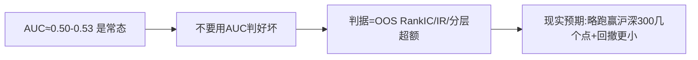

判据阈值(`verdict`):

| verdict | 条件(OOS) |
|---|---|
| `strong` | RankIC_mean ≥ 0.04 且 IR ≥ 0.5 且 vs_baseline > 0 且 分层单调 |
| `acceptable` | RankIC_mean ≥ 0.02 且 IR ≥ 0.3 且 vs_baseline ≥ 0 |
| `weak` | 指标为正但未超基线,或 fold 间方差过大 |
| `reject` | RankIC_mean ≤ 0 或分层无单调或 OOS 回撤过大 |

UI 必须显式提示:**AUC 0.52 是这个问题的正常水平,不是 bug**;A 股横截面选股的有效信号微弱,真正价值来自「在大量股票上稳定地略微占优 + 严格风控」,而非高 AUC。纸面前向验证数月,OOS RankIC 持续为正再考虑真钱。**目标是 IR 0.5-1.0、长期略跑赢沪深300并控制回撤,不是暴富。**

---

## 12. 训练页数据契约(前端 ↔ 后端)

### 12.1 页面区块与数据来源

| 区块 | 数据来源 | 关键字段 |
|---|---|---|
| 新建训练表单 | 本地 `feature_set` 列表 + 默认配置 | §10 配置 |
| 耗时预估卡 | `POST /api/train/estimate` | §8.6 |
| 运行中任务卡 | `GET /api/train/stream/{job_id}` SSE | phase/progress/fold/ETA/device |
| Loss/AUC/IC 曲线 | SSE 累积 + `curves.parquet` | train/valid loss、auc、rank_ic |
| 任务列表 | `GET /api/train/jobs` | status/progress/oos 摘要 |
| 版本库 | `GET /api/models` (查 `model_registry`) | version/status/oos_rank_ic/vs_baseline |
| 版本诊断 | `GET /api/models/{id}/diagnostics` | §11.1 各图数据 |
| 影子对比 | `GET /api/models/{id}/shadow` | §11.2 表 |

### 12.2 版本列表项契约 `GET /api/models`

```json
[{
  "id":"fnv1_v20260608",
  "model_id":"fundamental_north_v1",
  "version":"v20260608_153012",
  "algo":"ensemble","task":"cls",
  "train_start":"2018-01-01","train_end":"2026-03-31",
  "oos_rank_ic":0.041,"oos_ir":0.62,"oos_auc":0.523,
  "oos_top_excess":0.058,"vs_baseline":0.011,
  "verdict":"acceptable","status":"champion",
  "engine_loaded":true,"created_at":"2026-06-08T15:30:12+08:00"
}]
```

### 12.3 诊断数据契约 `GET /api/models/{id}/diagnostics`

```json
{
  "ic_series": [{"date":"2024-01-02","rank_ic":0.03}],
  "ic_cum": [{"date":"2024-01-02","cum":0.03}],
  "layered": [{"layer":1,"annual_ret":-0.04},{"layer":10,"annual_ret":0.11}],
  "top_nav": [{"date":"2024-01-02","model":1.0,"bench":1.0}],
  "feature_importance": [{"feature":"f_roe","gain":0.18}],
  "fold_ic_box": [{"fold":1,"rank_ic":0.05}],
  "summary": {"rank_ic_mean":0.041,"ir":0.62,"win_rate":0.58,"t_stat":2.7}
}
```

---

## 13. 关键文件/目录索引(engine 侧)

```
engine/sinan/training/
  features.py        # build_feature_matrix, 横截面预处理, 中性化
  labels.py          # make_labels(前向超额/分类/权重/泄漏断言)
  splits.py          # 时序分位切分 + purge + embargo
  walkforward.py     # fold 生成与遍历
  trainer.py         # train_fold, checkpoint, 设备探测, SSE 进度回调
  ensemble.py        # fold平均/多算法/stacking
  evaluate.py        # OOS IC/分层/IR/verdict
  registry.py        # 指纹/版本落盘/SQLite写入
  inference.py       # load_model/predict/预处理一致性
  diagnostics.py     # 诊断图数据/影子对比
  preflight.py       # §6 约束清单 fail-fast
```

---

# 后端与数据工程师

I now have everything I need: the prototype's exact risk parameters, signal pipeline, account model, data source fallback logic, and feature dims. Writing the chapter now.

# 后端与数据模型

> 本章定义司南（Sinan）的持久化层、Provider 抽象、两个 sidecar 进程（NestJS `api` / FastAPI `engine`）的契约、调度器与数据血缘。所有服务绑定 `127.0.0.1`，凭据加密落盘，零数据冷启动。

## 1. 进程与端口拓扑

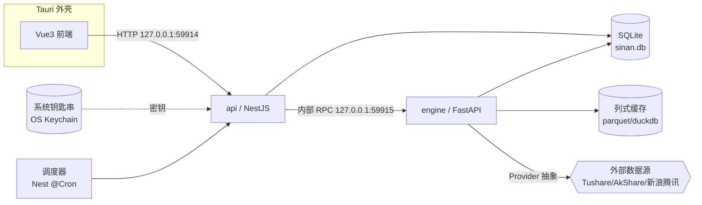

- `api`（NestJS，:59914）：唯一对前端暴露的入口；负责元数据 CRUD、鉴权（本地无鉴权，仅 CORS 锁 `tauri://localhost`）、凭据加解密、任务编排、SSE 进度推送。**前端永不直连 engine。**
- `engine`（FastAPI，:59915）：纯计算与 IO，只接受来自 `api` 的请求（校验 `X-Sinan-Internal` 头）。无状态业务逻辑，所有结果回写 SQLite / parquet。
- 端口可被设置覆盖（`settings.runtime.api_port` / `engine_port`），默认值参考上述。

数据根目录（跨平台，由 Tauri `appDataDir` 决定）：

```
$APPDATA/Sinan/
├─ sinan.db                 # SQLite 元数据主库（WAL 模式）
├─ cache/
│  ├─ prices/               # 列式行情缓存（parquet 分区）
│  ├─ factors/              # 因子矩阵缓存（parquet 分区）
│  ├─ fundamentals/         # 财务/估值缓存
│  └─ index/                # 指数与成分缓存
├─ duckdb/sinan.duckdb      # duckdb 只读视图（attach parquet，供回测/因子 SQL）
├─ models/<model_id>/<run_id>/   # 模型权重、scaler、metrics.json、curves.parquet
└─ logs/sinan-YYYYMMDD.log
```

---

## 2. SQLite 表结构

约定：所有表 `id` 用 `TEXT`（UUIDv7，时间有序、便于游标分页）；时间戳 `TEXT` 存 ISO-8601 UTC（`created_at`/`updated_at`），交易日 `trade_date` 存 `TEXT` `YYYY-MM-DD`；金额 `REAL`，股数 `INTEGER`；枚举存 `TEXT` 并加 `CHECK`。库启用 `PRAGMA journal_mode=WAL; foreign_keys=ON; busy_timeout=5000`。`portfolio` 维度统一取值 `'model' | 'personal'`，用于把两套持仓/盈亏物理隔离在同一组表里。

### 2.1 settings — 设置（单行 KV 或宽表，采用 KV）

| 字段 | 类型 | 约束/默认 | 说明 |
|---|---|---|---|
| key | TEXT | PK | 如 `theme`/`refresh_interval`/`close_behavior`/`float_window`/`auto_signal`/`smtp.*`/`active_provider`/`api_port` |
| value | TEXT | NOT NULL | JSON 编码值 |
| scope | TEXT | DEFAULT 'app' | `app` / `ui` / `runtime` |
| updated_at | TEXT | NOT NULL | |

预置键：`theme=light`、`refresh_interval=5`、`close_behavior=tray`、`float_window=false`、`auto_signal=true`、`daily_run_time=15:30`、`active_provider=tushare`、`market_filter=true`、`market_ma_days=20`。

### 2.2 credentials — 凭据加密存储（绝不明文）

| 字段 | 类型 | 约束 | 说明 |
|---|---|---|---|
| id | TEXT | PK | |
| provider | TEXT | NOT NULL, UNIQUE | `tushare`/`akshare`/`jukuan`/`custom` |
| cipher | BLOB | NOT NULL | AES-256-GCM 密文（明文为 `{token,...}` JSON） |
| nonce | BLOB | NOT NULL | GCM 12B 随机 nonce |
| tag | BLOB | NOT NULL | GCM 16B 认证标签 |
| key_ref | TEXT | NOT NULL | 主密钥来源：`keychain:sinan-mk`（系统钥匙串别名）或 `derived`（首启随机生成，DEK 包裹） |
| fingerprint | TEXT | | 明文 token 的 SHA-256 前 8 位，仅用于 UI 显示「已配置 ****a1b2」，不可逆 |
| created_at / updated_at | TEXT | NOT NULL | |

**加密链路**：主密钥（MK）由 OS 钥匙串保管（macOS Keychain / Windows Credential Manager / Linux Secret Service，经 Tauri keyring）。MK 解出后在内存 AES-256-GCM 加解密 token；DB 里只存密文。token 永不进日志、永不出本机、永不返回前端（接口只回 `configured:true` + `fingerprint`）。

索引：`UNIQUE(provider)`。

### 2.3 strategies — 策略

| 字段 | 类型 | 约束 | 说明 |
|---|---|---|---|
| id | TEXT | PK | |
| name | TEXT | NOT NULL | |
| kind | TEXT | CHECK in (`factor_score`,`ml`,`hybrid`) | 因子打分 / ML / 叠加 |
| params_json | TEXT | NOT NULL | 风控与选股参数快照（见 §2.x 默认值） |
| universe_json | TEXT | | 股票池定义（板块/流动性阈值） |
| active_model_id | TEXT | FK→models.id NULL | 绑定的推理模型 |
| status | TEXT | DEFAULT 'draft' CHECK in (`draft`,`active`,`archived`) | |
| created_at / updated_at | TEXT | NOT NULL | |

`params_json` 默认（沿用 AlphaQuant 调参结论）：`{max_holdings:5, max_position_ratio:0.20, buy_threshold:0.65, sell_threshold:0.35, stop_loss:-0.12, take_profit:0.30, portfolio_stop:-0.12, min_hold_days:10, cooldown_days:5, liq_window_days:60, liq_min_amount_yi:2.0, market_filter:true, market_ma_days:20, signal_lag:1}`。

索引：`idx_strategies_status(status)`。

### 2.4 models — 模型（逻辑模型，跨版本）

| 字段 | 类型 | 约束 | 说明 |
|---|---|---|---|
| id | TEXT | PK | |
| name | TEXT | NOT NULL | |
| arch | TEXT | CHECK in (`lstm`,`gbdt`,`factor_linear`,`ensemble`) | |
| feature_set_json | TEXT | NOT NULL | 特征列表与维度（如 16技术+3市场=19，见原型 FEATURE_DIM） |
| label_def_json | TEXT | NOT NULL | `{horizon:5, type:'excess', threshold:0.02, lag:1}` |
| latest_run_id | TEXT | FK→model_runs.id NULL | 当前生产版本 |
| created_at / updated_at | TEXT | NOT NULL | |

### 2.5 model_runs — 训练运行/版本（诚实样本外的核心台账）

| 字段 | 类型 | 约束 | 说明 |
|---|---|---|---|
| id | TEXT | PK | |
| model_id | TEXT | FK→models.id, NOT NULL | |
| version | INTEGER | NOT NULL | model 内自增版本号 |
| status | TEXT | CHECK in (`queued`,`running`,`done`,`failed`,`canceled`) | |
| hyperparams_json | TEXT | NOT NULL | 完整超参快照 |
| split_json | TEXT | NOT NULL | 时序切分：`{train_end:'2022-12-31', purge_days:5, embargo_days:5, valid_end, test_start}` |
| train_start / train_end | TEXT | | |
| oos_start | TEXT | NOT NULL | **样本外起点 = train_end + purge + 1**，回测只测此后 |
| metrics_json | TEXT | | `{auc, acc, ir, sharpe_oos, excess_oos, max_dd, n_samples}` |
| artifact_path | TEXT | | `models/<model_id>/<run_id>/` |
| curves_path | TEXT | | `curves.parquet`（epoch, train_loss, val_loss, val_auc） |
| progress | REAL | DEFAULT 0 | 0–1，供 SSE |
| current_epoch / total_epochs | INTEGER | | |
| error | TEXT | | 失败原因 |
| started_at / finished_at | TEXT | | |

索引：`idx_runs_model(model_id, version DESC)`、`idx_runs_status(status)`。

> 防未来函数硬约束在写入时校验：`oos_start > train_end + purge_days`，否则拒绝创建 run。

### 2.6 indicators — 指标 / 自定义指标

| 字段 | 类型 | 约束 | 说明 |
|---|---|---|---|
| id | TEXT | PK | |
| code | TEXT | UNIQUE NOT NULL | 唯一标识，如 `rsi14`、`my_value_score` |
| name | TEXT | NOT NULL | 中文显示名 |
| category | TEXT | CHECK in (`technical`,`fundamental`,`northbound`,`custom`) | |
| kind | TEXT | CHECK in (`builtin`,`formula`) | 内置 vs 用户公式 |
| expr | TEXT | | 公式表达式（仅 formula；见 §6 安全求值） |
| params_json | TEXT | | 默认参数，如 `{window:14}` |
| depends_json | TEXT | | 依赖字段/指标（用于拓扑求值与降级判断） |
| requires_caps_json | TEXT | | 需要的 provider 能力（如 `["northbound"]`，缺则该指标对当前源置灰） |
| output_kind | TEXT | DEFAULT 'series' CHECK in (`series`,`scalar`) | |
| enabled | INTEGER | DEFAULT 1 | |
| created_at / updated_at | TEXT | | |

索引：`UNIQUE(code)`、`idx_ind_category(category)`。

### 2.7 holdings_model & holdings_personal — 两套持仓（分表，结构一致）

> 物理分表，避免误聚合；查询时各走各表。字段相同，仅 `holdings_personal` 多 `note`。

| 字段 | 类型 | 约束 | 说明 |
|---|---|---|---|
| id | TEXT | PK | |
| strategy_id | TEXT | FK→strategies.id（personal 表可 NULL） | model 表必填 |
| stock_code | TEXT | NOT NULL | `sh600519` |
| stock_name | TEXT | | 冗余存名，离线可显示 |
| shares | INTEGER | NOT NULL | |
| avg_cost | REAL | NOT NULL | 移动加权成本 |
| current_price | REAL | | 最近一次估值价 |
| market_value | REAL | | |
| buy_date | TEXT | NOT NULL | T+1 与 min_hold_days 判定 |
| last_buy_date | TEXT | | 冷却判定 |
| float_pnl | REAL | | 浮动盈亏 |
| float_pnl_pct | REAL | | |
| note | TEXT | | 仅 personal：用户备注 |
| updated_at | TEXT | NOT NULL | |

索引：`UNIQUE(strategy_id, stock_code)`（model）、`UNIQUE(stock_code)`（personal 单组合）、`idx_hold_code(stock_code)`。

### 2.8 trades — 成交流水（两套共用，portfolio 区分）

| 字段 | 类型 | 约束 | 说明 |
|---|---|---|---|
| id | TEXT | PK | |
| portfolio | TEXT | CHECK in (`model`,`personal`) NOT NULL | |
| strategy_id | TEXT | FK NULL | model 成交关联策略 |
| stock_code | TEXT | NOT NULL | |
| side | TEXT | CHECK in (`buy`,`sell`) | |
| shares | INTEGER | NOT NULL | |
| price | REAL | NOT NULL | 成交价 |
| amount | REAL | NOT NULL | 成交额（含方向） |
| commission | REAL | NOT NULL | 佣金 |
| stamp_tax | REAL | NOT NULL | 印花税（卖出 0.05%；prototype 0.0013 已含） |
| reason | TEXT | | `signal`/`stop_loss`/`take_profit`/`rank_out`/`market_filter`/`manual` |
| signal_id | TEXT | FK→signals.id NULL | 血缘：哪条信号触发 |
| trade_date | TEXT | NOT NULL | |
| created_at | TEXT | NOT NULL | |

索引：`idx_trades_pf_date(portfolio, trade_date)`、`idx_trades_code(stock_code)`。

### 2.9 signals — 当日信号

| 字段 | 类型 | 约束 | 说明 |
|---|---|---|---|
| id | TEXT | PK | |
| strategy_id | TEXT | FK NOT NULL | |
| model_run_id | TEXT | FK→model_runs.id NULL | 出信号用的模型版本（血缘） |
| trade_date | TEXT | NOT NULL | 信号所属交易日 |
| stock_code | TEXT | NOT NULL | |
| stock_name | TEXT | | |
| action | TEXT | CHECK in (`buy`,`sell`,`hold`) | |
| score | REAL | | 模型概率/因子打分 |
| rank | INTEGER | | 当日横截面排名 |
| factor_breakdown_json | TEXT | | 各因子贡献，供解释 |
| executed | INTEGER | DEFAULT 0 | 是否已被模拟盘执行 |
| effective_date | TEXT | | 实际生效日（信号滞后1日 = trade_date 下一交易日） |
| created_at | TEXT | NOT NULL | |

索引：`UNIQUE(strategy_id, trade_date, stock_code)`、`idx_signals_date(trade_date)`。

### 2.10 daily_pnl — 当日收益（个人+模型，分别记账）

| 字段 | 类型 | 约束 | 说明 |
|---|---|---|---|
| id | TEXT | PK | |
| portfolio | TEXT | CHECK in (`model`,`personal`) NOT NULL | |
| strategy_id | TEXT | FK NULL | model 维度细分到策略 |
| trade_date | TEXT | NOT NULL | |
| total_assets | REAL | NOT NULL | 总资产 |
| cash | REAL | NOT NULL | |
| holding_value | REAL | NOT NULL | |
| day_pnl | REAL | NOT NULL | 当日盈亏 |
| day_pnl_pct | REAL | NOT NULL | 当日收益率 |
| cum_pnl_pct | REAL | | 累计收益率 |
| peak_assets | REAL | | 峰值净值（回撤基准） |
| drawdown | REAL | | 当前回撤 |
| benchmark_pct | REAL | | 沪深300当日涨跌 |
| excess_pct | REAL | | 超额（day_pnl_pct - benchmark） |
| created_at | TEXT | NOT NULL | |

索引：`UNIQUE(portfolio, strategy_id, trade_date)`、`idx_pnl_date(trade_date)`。

### 2.11 news — 资讯（含 AI 解读）

| 字段 | 类型 | 约束 | 说明 |
|---|---|---|---|
| id | TEXT | PK | |
| title | TEXT | NOT NULL | |
| source | TEXT | | |
| url | TEXT | | |
| stock_codes_json | TEXT | | 关联个股 |
| published_at | TEXT | | |
| summary | TEXT | | AI 摘要 |
| sentiment | TEXT | CHECK in (`pos`,`neu`,`neg`) NULL | AI 情绪 |
| ai_status | TEXT | DEFAULT 'pending' CHECK in (`pending`,`done`,`skipped`) | |
| created_at | TEXT | NOT NULL | |

索引：`idx_news_pub(published_at DESC)`。

### 2.12 logs — 运行日志

| 字段 | 类型 | 约束 | 说明 |
|---|---|---|---|
| id | TEXT | PK | |
| ts | TEXT | NOT NULL | |
| level | TEXT | CHECK in (`debug`,`info`,`warn`,`error`) | |
| source | TEXT | | `api`/`engine`/`scheduler`/`provider.tushare` |
| job_id | TEXT | FK→data_jobs.id NULL | 关联作业 |
| message | TEXT | NOT NULL | |
| context_json | TEXT | | |

索引：`idx_logs_ts(ts DESC)`、`idx_logs_level(level)`。结构化日志同时落 `logs/sinan-YYYYMMDD.log`。

### 2.13 data_jobs — 数据/训练作业（冷启动建缓存、断点续传的核心）

| 字段 | 类型 | 约束 | 说明 |
|---|---|---|---|
| id | TEXT | PK | |
| type | TEXT | CHECK in (`cache_build`,`incremental`,`train`,`signal_gen`,`paper_run`,`news_fetch`) | |
| provider | TEXT | | 使用的数据源 |
| status | TEXT | CHECK in (`queued`,`running`,`paused`,`done`,`failed`,`canceled`) | |
| trigger | TEXT | CHECK in (`manual`,`schedule`,`onboarding`) | |
| params_json | TEXT | | 入参（universe、日期区间、限速档） |
| total | INTEGER | DEFAULT 0 | 总单元数（如股票数） |
| done_count | INTEGER | DEFAULT 0 | 已完成 |
| failed_count | INTEGER | DEFAULT 0 | |
| cursor_json | TEXT | | **断点游标**：`{last_code, last_date, page}`，续传从此恢复 |
| progress | REAL | DEFAULT 0 | |
| rate_limit_json | TEXT | | 限速状态（令牌桶剩余、下次可用时间） |
| lineage_json | TEXT | | 数据血缘快照（见 §8） |
| error | TEXT | | |
| started_at / finished_at | TEXT | | |
| created_at / updated_at | TEXT | NOT NULL | |

索引：`idx_jobs_status(status)`、`idx_jobs_type(type)`。

### 2.14 data_coverage — 缓存覆盖台账（增量与血缘）

| 字段 | 类型 | 约束 | 说明 |
|---|---|---|---|
| stock_code | TEXT | PK 复合 | |
| dataset | TEXT | PK 复合 CHECK in (`price`,`fundamental`,`daily_basic`,`northbound`,`adj_factor`) | |
| provider | TEXT | NOT NULL | 实际写入该段的源 |
| first_date | TEXT | | 已覆盖起 |
| last_date | TEXT | NOT NULL | 已覆盖止（增量从此 +1 拉） |
| rows | INTEGER | | |
| checksum | TEXT | | 末段行内容指纹，校验损坏 |
| updated_at | TEXT | NOT NULL | |

PK：`(stock_code, dataset)`。这是增量更新和"哪段数据来自哪个 provider"血缘的单一事实源。

### 2.15 providers — 数据源能力声明（注册表，可只读内置 + 用户自定义行）

| 字段 | 类型 | 约束 | 说明 |
|---|---|---|---|
| id | TEXT | PK | `tushare`/`akshare`/`realtime_sina`/`realtime_tencent` |
| display_name | TEXT | NOT NULL | |
| caps_json | TEXT | NOT NULL | 能力声明（见 §3.2） |
| needs_token | INTEGER | NOT NULL | |
| rate_limit_json | TEXT | | 默认限速（如 tushare 500/min） |
| priority | INTEGER | | 同能力下选用优先级 |
| status | TEXT | DEFAULT 'unknown' CHECK in (`ok`,`error`,`unknown`) | 最近连通性 |
| last_check_at | TEXT | | |

---

## 3. Provider 抽象层

### 3.1 统一接口

所有数据源实现同一 Python ABC（在 engine 内），按能力声明优雅降级。

```python
class DataProvider(ABC):
    id: str
    def capabilities(self) -> Caps: ...           # 声明支持哪些数据集/字段
    def test_connection(self) -> ConnResult: ...   # 连通性 + 积分/频率探测
    # 历史
    def daily_bars(self, code, start, end, adjust='qfq') -> DataFrame: ...
    def adj_factor(self, code, start, end) -> DataFrame: ...      # tushare 专属
    def daily_basic(self, code, start, end) -> DataFrame: ...     # PE/PB/换手/市值
    def financials(self, code, period) -> DataFrame: ...          # 三表/fina_indicator
    def northbound(self, code, start, end) -> DataFrame: ...      # moneyflow_hsgt
    def index_bars(self, index_code, start, end) -> DataFrame: ...
    def index_members(self, index_code, date) -> list: ...
    def industry(self, code) -> dict: ...                         # 申万行业
    def stock_list(self) -> DataFrame: ...
    # 实时
    def realtime_quotes(self, codes: list) -> dict: ...           # 现价/昨收/涨跌
```

实现类：

- **TushareProvider**（首选）：caps 全开（依用户积分动态裁剪）；令牌桶限速 500/min（可配）；标准字段名映射到内部 schema。
- **AkshareProvider**（免费兜底）：caps 覆盖价量、daily_basic 部分、行业、指数；无北向逐票则置 `northbound:false`；无 token。
- **RealtimeProvider**（新浪/腾讯）：仅 `realtime_quotes`，三级降级（新浪→腾讯，沿用原型逻辑），用于当日收益与盘中刷新；caps 只声明 `realtime:true`。

注册表 + 工厂：`ProviderRegistry.get(active_provider)`；实时报价单独走 `RealtimeProvider`，与历史源解耦（历史可 tushare、实时仍用新浪，互不影响）。

### 3.2 能力声明（caps_json）与降级

```jsonc
{
  "daily_bars": true, "adjust_qfq": true, "adj_factor": true,
  "daily_basic": true, "pe_pb": true, "turnover": true, "market_cap": true,
  "financials": true, "fina_indicator": true,
  "northbound": true, "index_bars": true, "index_members": true,
  "industry_sw": true, "forecast": true,
  "realtime": false, "max_history_years": 10,
  "rate_limit": {"per_min": 500}
}
```

**降级规则**（engine 在构因子前对齐 caps）：

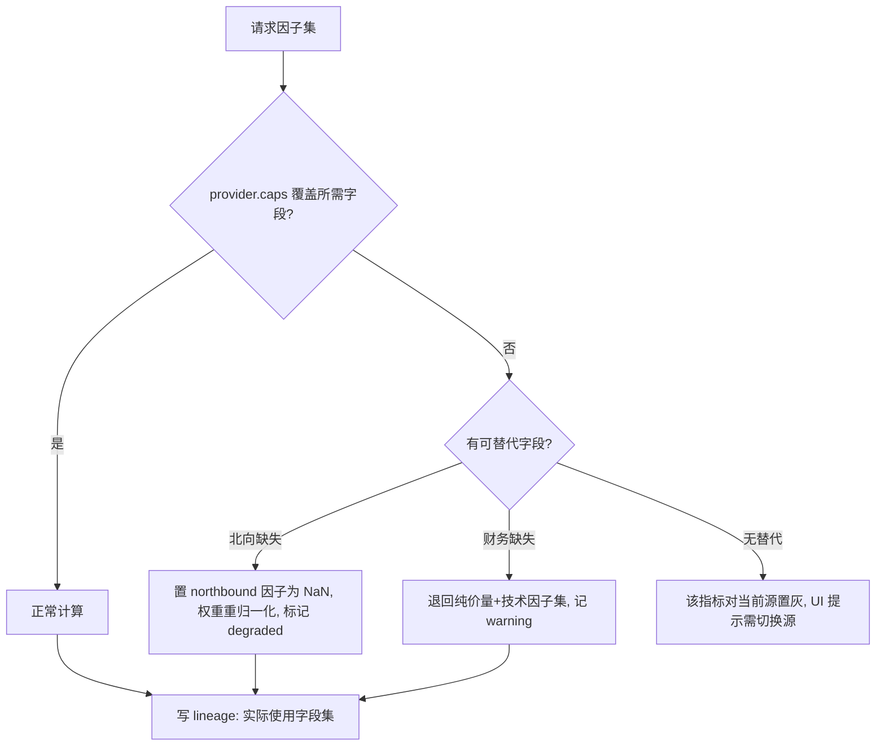

免费源缺北向/财务时，因子打分自动收缩到「技术+价量」子集并在 `daily_pnl`/信号上打 `degraded:true` 标记，诚实告知用户当前预期 alpha 更低（呼应教训2）。

### 3.3 零数据冷启动建缓存作业

`cache_build` 作业（onboarding 触发或手动）：

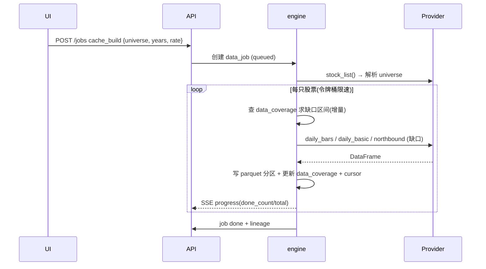

- **增量**：以 `data_coverage.last_date` 为锚，只拉缺口；已有则跳过。
- **断点续传**：每完成 N 只 flush `cursor_json`；崩溃/暂停后从游标恢复，不重拉。
- **限速**：令牌桶按 `rate_limit_json`（tushare 500/min；免费源按原型经验 4 并发 + 随机退避）。429/503 指数退避并把令牌桶置冷却，状态写回 job 供 UI 显示「限流中，预计 x 秒后继续」。
- **可暂停**：`PATCH /jobs/{id} {action:pause|resume|cancel}`，pause 保留 cursor。

---

## 4. 列式缓存布局

行情与因子用 parquet 分区，duckdb `attach` 为只读视图供回测/因子 SQL（无未来函数：查询带 `trade_date <= asof`）。

```
cache/prices/   dataset=daily/board=sh/year=2024/part-sh-2024.parquet
                schema: stock_code, trade_date, open, high, low, close,
                        volume, amount, pct_change, turnover, adj_factor, provider
cache/factors/  model_run=<run_id>/board=sh/year=2024/part.parquet
                schema: stock_code, trade_date, <factor_1..n>, label, label_horizon
cache/fundamentals/ stock_code=sh600519/period=2024Q1/part.parquet
                schema: end_date, pe, pb, roe, eps, total_mv, ... , provider
cache/index/    index_code=000300.SH/year=2024/part.parquet
```

- 分区键：`board`（sh/sz/bj）+ `year`，兼顾增量写入与查询裁剪。
- 因子矩阵按 `model_run` 隔离，保证每个版本特征可复现、可审计（诚实样本外）。
- `provider` 列贯穿，行级血缘。
- duckdb 视图示例：`CREATE VIEW v_prices AS SELECT * FROM read_parquet('cache/prices/**/*.parquet', hive_partitioning=1)`。

---

## 5. REST API 契约（NestJS `api`，base `/api/v1`）

通用：JSON；错误体 `{error:{code,message,detail,job_id?}}`；分页 `?cursor=&limit=`；长任务返回 `202 {job_id}` 并经 SSE `/events/jobs/{id}` 推 `{progress,status,message}`。

### 5.1 关键端点总表

| 资源 | 方法 | 端点 | 说明 |
|---|---|---|---|
| 健康 | GET | `/health` | api+engine 联通自检 |
| 设置 | GET/PUT | `/settings` `/settings/{key}` | 主题/刷新/调度等 |
| 凭据 | GET | `/providers` | 源列表+caps+status |
| 凭据 | GET | `/providers/{id}/credential` | 仅返回 `{configured,fingerprint}` |
| 凭据 | PUT | `/providers/{id}/credential` | 写 token→加密落盘，**永不回显** |
| 凭据 | DELETE | `/providers/{id}/credential` | 清除 |
| 连通性 | POST | `/providers/{id}/test` | 测连通+探积分/频率，更新 status |
| 激活源 | PUT | `/providers/active` | `{provider}` 切换历史源 |
| 缓存作业 | POST | `/jobs` | 建/增量/训练等，body `{type,params}` |
| 作业 | GET | `/jobs` `/jobs/{id}` | 列表/详情(含 cursor/progress) |
| 作业 | PATCH | `/jobs/{id}` | `{action:pause/resume/cancel}` |
| 作业进度 | GET(SSE) | `/events/jobs/{id}` | 实时进度流 |
| 策略 | CRUD | `/strategies` `/strategies/{id}` | |
| 模型 | GET/POST | `/models` `/models/{id}` | |
| 训练 | POST | `/models/{id}/train` | 创建 model_run（校验 oos_start） |
| 训练版本 | GET | `/models/{id}/runs` `/runs/{rid}` | 含 metrics |
| 训练曲线 | GET | `/runs/{rid}/curves` | loss/AUC 曲线点 |
| 激活版本 | PUT | `/models/{id}/active-run` | `{run_id}` |
| 指标 | CRUD | `/indicators` `/indicators/{id}` | 含自定义公式 |
| 指标校验 | POST | `/indicators/validate` | 公式语法+依赖+caps 检查 |
| 指标预览 | POST | `/indicators/{id}/preview` | 在样本上求值 |
| 行情 | GET | `/quotes?codes=` | 实时报价（经 RealtimeProvider） |
| K线 | GET | `/prices/{code}?start=&end=&adjust=` | 历史日线 |
| 持仓-模型 | GET | `/portfolios/model/holdings` | |
| 持仓-个人 | CRUD | `/portfolios/personal/holdings` | 手动维护 |
| 成交 | GET | `/trades?portfolio=&from=&to=` | |
| 信号 | GET | `/signals?date=` | 当日信号 |
| 信号手动触发 | POST | `/signals/generate` | `{strategy_id,date?}`→202 |
| 当日收益 | GET | `/pnl/daily?portfolio=&from=&to=` | 个人/模型分别 |
| 模拟盘 | POST | `/paper/run` | 盘后跑一轮（手动触发）→202 |
| 回测 | POST | `/backtests` | →202，结果含曲线+指标 |
| 资讯 | GET | `/news?cursor=` | |
| 资讯解读 | POST | `/news/{id}/interpret` | AI 摘要/情绪 |
| 日志 | GET | `/logs?level=&source=&cursor=` | |

### 5.2 关键 request/response schema

`PUT /providers/tushare/credential`
```jsonc
// req
{"token":"<明文>"}            // 立即加密，明文不入库/日志/响应
// res 200
{"configured":true,"fingerprint":"a1b2c3d4"}
```

`POST /providers/tushare/test`
```jsonc
// res 200
{"status":"ok","latency_ms":210,
 "caps":{"northbound":true,"financials":true,"realtime":false},
 "rate_limit":{"per_min":500},"points_hint":5000,"degraded":[]}
// res 200 (降级)
{"status":"ok","caps":{"northbound":false},"degraded":["northbound 不可用，因子集将退回价量+财务"]}
```

`POST /jobs` (cache_build)
```jsonc
// req
{"type":"cache_build",
 "params":{"universe":{"boards":["sh","sz"],"liq_min_amount_yi":2.0},
           "years":10,"datasets":["price","daily_basic","northbound"],
           "rate":{"per_min":500},"resume":true}}
// res 202
{"job_id":"01J...","status":"queued","total":3800}
```

`POST /models/{id}/train`
```jsonc
// req
{"hyperparams":{"arch":"lstm","epochs":300,"batch":512,"lr":3e-4,"ensemble":3},
 "split":{"train_end":"2022-12-31","purge_days":5,"embargo_days":5},
 "label":{"horizon":5,"type":"excess","threshold":0.02,"lag":1}}
// res 202  (若 oos_start<=train_end+purge → 422 未来函数校验失败)
{"run_id":"01J...","oos_start":"2023-01-09","status":"queued"}
```

`GET /pnl/daily?portfolio=model&from=2026-05-01`
```jsonc
{"items":[{"trade_date":"2026-06-05","day_pnl_pct":0.42,
  "benchmark_pct":0.11,"excess_pct":0.31,"drawdown":-0.03,
  "total_assets":1042300}], "degraded":false}
```

---

## 6. FastAPI `engine` 端点（内部，:59915）

仅 `api` 可调，校验 `X-Sinan-Internal`。返回结果写库/写 parquet，长任务经回调更新 `data_jobs`。

| 端点 | 方法 | 入参 | 产出 |
|---|---|---|---|
| `/engine/quotes` | POST | `{codes,provider}` | 实时报价 dict（新浪→腾讯降级） |
| `/engine/prices` | POST | `{code,start,end,adjust,provider}` | 日线 DataFrame→JSON |
| `/engine/cache/build` | POST | job 参数 | 流式建缓存（增量/断点/限速） |
| `/engine/cache/incremental` | POST | `{date}` | 增量补当日 + 更新 coverage |
| `/engine/factors/compute` | POST | `{universe,factor_set,asof,model_run}` | 写 factors parquet |
| `/engine/indicators/eval` | POST | `{expr,params,sample}` | 公式安全求值预览 |
| `/engine/valuation` | POST | `{code,asof}` | PE/PB/估值分位（基本面） |
| `/engine/train` | POST | run 参数 | 训练，回调 progress/curves/metrics |
| `/engine/infer` | POST | `{model_run_id,universe,asof}` | 打分→候选 |
| `/engine/signals/generate` | POST | `{strategy_id,date}` | 出当日信号（含因子分解） |
| `/engine/paper/run` | POST | `{strategy_id,date}` | 模拟盘一轮：风控→撮合→记账 |
| `/engine/backtest` | POST | `{strategy_id,start,end}` | 走 OOS 回测，返回曲线+指标 |
| `/engine/provider/test` | POST | `{provider}` | 连通+caps 探测 |
| `/engine/calendar/is-trade-day` | GET | `{date}` | 交易日判定（节假日表+周末） |

**自定义指标安全求值（§2.6 / `/engine/indicators/eval`）**：白名单 AST，仅允许列引用（`close`,`high`,`pe`,`nb_net`…）、算子（`+ - * / ** > < & |`）和函数集 `{ma, ema, std, rsi, rank, ts_delay, ts_corr, zscore, log, abs, max, min}`；禁用 `import`/属性访问/调用任意函数；编译期校验依赖字段是否在当前 provider caps 内，缺则报 `degraded`。示例公式：`zscore(-pe) * 0.4 + zscore(roe) * 0.4 + rank(nb_net_5d) * 0.2`。

**信号管线（防未来函数，呼应教训1/3）**：

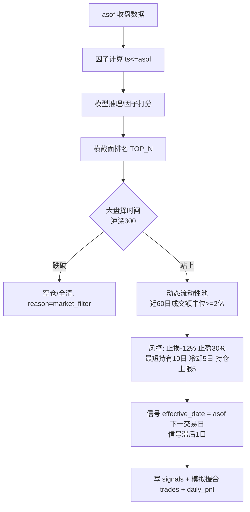

---

## 7. 调度器

NestJS `@Cron`（或 Tauri 侧持久定时）驱动，逻辑全在 `api`，避免前端在线才跑。

| 任务 | 时间 | 行为 |
|---|---|---|
| 盘后主流程 | 交易日 15:30 | 增量拉数 → 出信号 → 模拟盘撮合 → 记 daily_pnl（个人+模型分别）→ 可选 SMTP 通知 |
| 缓存生长 | 交易日 15:35 | 抓 N 只未缓存新票（`grow_cache_per_day`），逐步覆盖全市场 |
| 盘中刷新 | 09:30–11:30 / 13:00–15:00 每 N 秒 | 仅前端打开时拉实时报价，更新当日浮盈（不写 trades） |

- **节假日跳过**：`/engine/calendar/is-trade-day` 先判周末，再查节假日表（内置 A 股交易日历，缺失时降级为仅排除周末，沿用原型策略）；非交易日直接记日志退出。
- **可手动触发**：`POST /signals/generate`、`POST /paper/run`、`POST /jobs`（cache_build/incremental）均等价于调度路径，trigger 标 `manual`，用于补跑或 onboarding。
- **幂等**：盘后主流程以 `(strategy_id, trade_date)` 去重，重复触发不重复记账（`signals`/`daily_pnl` 唯一约束兜底）。
- 调度参数（`daily_run_time`、`auto_signal`、`grow_cache_per_day`）来自 `settings`，可热改不重启。

---

## 8. 错误处理 / 重试 / 数据血缘

**错误分级**：`transient`（网络/429/503→指数退避重试，最多 N 次，沿用原型退避）、`degraded`（源缺字段→降级 caps 子集继续，标记并告知）、`fatal`（token 失效/磁盘满→停作业、写 `data_jobs.error` + `logs.error`、SSE 推 failed）。所有外部调用包裹统一 `ProviderError(code, retryable)`。

**重试**：HTTP 429/503 指数退避 + 抖动；令牌桶冷却写回 `data_jobs.rate_limit_json`，UI 显示倒计时；作业级失败保留 `cursor`，下次 `resume` 续传，已成功单元不重拉。

**数据血缘**（`lineage_json` / `data_coverage.provider` / parquet `provider` 列三层）：每段数据记录 `{provider, fetched_at, datasets, asof, degraded, code_range}`。训练 run 的 `split_json` + 因子 parquet 的 `model_run` 分区构成完整可复现链：给定一个信号，可回溯到「哪个模型版本 → 哪份因子矩阵 → 哪个 provider 的哪段原始数据 → 训练截止日与 OOS 边界」，满足诚实样本外审计与「这条买入建议从何而来」的可解释要求。

---

文件参考（本章所依据的原型实现，均为绝对路径）：
- `D:\Personal\AlphaQuant\data\loader.py`（三级降级、增量缓存、令牌桶/限速雏形）
- `D:\Personal\AlphaQuant\data\realtime.py`（实时报价新浪→腾讯降级、交易日/盘中判定）
- `D:\Personal\AlphaQuant\paper_trading\account.py`（虚拟账户、T+1、移动加权成本）
- `D:\Personal\AlphaQuant\paper_trading\risk.py`（单股/组合止损、峰值回撤、暂停态）
- `D:\Personal\AlphaQuant\paper_trading\scheduler.py`（15:30 盘后调度）
- `D:\Personal\AlphaQuant\config.py`（风控/模型/切分默认参数，已并入上文表默认值）

---

# 前端/UX/设计专家

# 前端与设计系统

> 本章定义司南(Sinan)桌面端的信息架构、逐页设计、设计系统(Design Tokens)、状态管理、图表方案、桌面特性、实时刷新与空状态/引导态。前端为 Tauri + Vue3 + TypeScript;调用本机 api 网关(`http://127.0.0.1:59914`)与 engine(`http://127.0.0.1:59915`,经网关代理或直连)。所有设计贯彻 BYO + 全本机原则:**软件随包零数据/零模型/零 token,首启即引导用户从自己的数据源生成一切**。

---

## 1. 信息架构与导航

### 1.1 全局布局

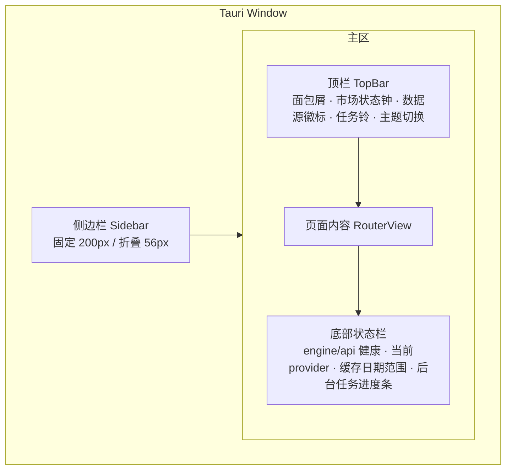

- **三层骨架**:`AppShell`(侧边栏 + 顶栏 + 状态栏)→ `RouterView`(页面)→ 页内卡片栅格。
- **窗口最小尺寸** 1100×720;<1280 时侧边栏自动折叠为仅图标(56px)。
- **顶栏(TopBar)** 常驻元素:
  - 面包屑(当前页路径)
  - **市场状态钟**:`盘前 / 集合竞价 / 连续竞价 / 午休 / 已收盘 / 非交易日`,带状态圆点(交易中=绿,休市=灰)
  - **数据源徽标**:`Tushare Pro · 5000分` / `AkShare(免费)` / `未配置`(红),点击直达设置→数据源
  - **任务铃**:后台任务数(训练/建缓存/回测),红点表示有运行中
  - 主题切换(浅/深/跟随系统)
- **状态栏(StatusBar)**:engine 心跳、api 心跳、当前 provider、本地缓存覆盖区间(如 `2018-01-02 ~ 2026-06-05 · 4821只`)、全局任务进度细条。

### 1.2 侧边栏菜单(9 主项)

| 顺序 | 路由 | 名称 | 图标语义 | 徽标/角标 | 未配置数据源时 |
|---|---|---|---|---|---|
| 1 | `/dashboard` | 总览 | 仪表盘 | — | 显示引导卡 |
| 2 | `/market` | 行情 | 蜡烛图 | 实时刷新转圈 | 锁(灰) |
| 3 | `/news` | 资讯 | 文档+AI星 | 未读数 | 锁 |
| 4 | `/indicators` | 指标 | 函数 f(x) | 自定义指标数 | 锁 |
| 5 | `/models` | 模型 | 神经节点 | 训练中脉冲点 | 锁 |
| 6 | `/signals` | 信号 | 雷达 | 当日新信号数(蓝) | 锁 |
| 7 | `/portfolio` | 持仓 | 钱包 | 个人/模型分页 | 个人可用·模型锁 |
| 8 | `/backtest` | 回测 | 折线对比 | — | 锁 |
| 9 | `/logs` | 日志 | 终端 | 错误红点 | 可用 |
| ⚙ | `/settings` | 设置 | 齿轮 | onboarding 未完成→红点 | **永远可用·高亮** |

- **菜单分组**:`监控`(总览/行情/资讯)·`研究`(指标/模型/回测)·`交易`(信号/持仓)·`系统`(日志/设置),分组用细描边分隔 + 8px 灰标签。
- **锁定态**:未完成 onboarding 时,除 总览/设置/日志 外的项显示锁图标 + 禁用点击 + tooltip「请先在『设置 → 数据源』配置并建立本地缓存」。点击直接跳设置。

### 1.3 路由表(Vue Router)

```ts
const routes = [
  { path: '/', redirect: '/dashboard' },
  { path: '/onboarding', component: OnboardingWizard, meta: { fullscreen: true, noShell: true } },
  { path: '/dashboard', component: Dashboard, meta: { title: '总览' } },
  { path: '/market', component: Market, meta: { title: '行情', needsData: true } },
  { path: '/market/:tsCode', component: MarketDetail, meta: { needsData: true } },
  { path: '/news', component: News, meta: { needsData: true } },
  { path: '/indicators', component: Indicators, meta: { needsData: true } },
  { path: '/indicators/editor/:id?', component: IndicatorEditor, meta: { needsData: true } },
  { path: '/models', component: Models, meta: { needsData: true } },
  { path: '/models/train/:runId?', component: ModelTrain, meta: { needsData: true } },
  { path: '/models/:modelId', component: ModelDetail, meta: { needsData: true } },
  { path: '/signals', component: Signals, meta: { needsData: true } },
  { path: '/portfolio', component: Portfolio, meta: {} },        // 个人持仓不需数据源
  { path: '/backtest', component: Backtest, meta: { needsData: true } },
  { path: '/logs', component: Logs, meta: {} },
  { path: '/settings/:tab?', component: Settings, meta: { title: '设置' } },
]
```

- **全局守卫**:`meta.needsData && !onboardingDone` → 重定向 `/settings/datasource` 并弹 toast。首启 `onboardingDone===false` → 强制 `/onboarding`。

### 1.4 前端目录结构

```
src/
├── main.ts
├── App.vue                      # 决定渲染 OnboardingWizard 还是 AppShell
├── shell/
│   ├── AppShell.vue
│   ├── Sidebar.vue  TopBar.vue  StatusBar.vue  TaskBell.vue  MarketClock.vue
├── pages/
│   ├── dashboard/  market/  news/  indicators/  models/  signals/
│   ├── portfolio/  backtest/  logs/  settings/  onboarding/
├── components/
│   ├── base/        # SButton SCard SDot STag STable SModal SEmpty SProgress SSparkline
│   ├── charts/      # KLineChart EquityCurve LossAucChart Heatmap GaugePie
│   └── biz/         # SignalCard HoldingRow FactorScoreBar ProviderBadge RiskGateStrip
├── stores/          # Pinia: app market models signals portfolio settings tasks news
├── api/             # client.ts(axios) + 各域 endpoints + ws.ts + types.ts
├── composables/     # usePolling useTask useTheme useMarketStatus useSSE
├── design/          # tokens.css  theme-light.css  theme-dark.css  pnl.css
└── locales/zh-CN.ts
```

---

## 2. 设计系统(Design Tokens)

### 2.1 核心理念:三套色彩通道**严格解耦**

A股语义与系统语义不可混用——这是地基级约束:

| 通道 | 含义 | 浅色 | 深色 | 用途 |
|---|---|---|---|---|
| **盈亏色 PnL** | 涨/正收益 | `#E5453A`(红) | `#F0564B` | K线阳、上涨、正收益数字、盈利持仓 |
| | 跌/负收益 | `#0E9A6C`(绿) | `#21B583` | K线阴、下跌、负收益数字、亏损持仓 |
| | 平/0 | `#8A8F99` | `#9AA0AC` | 涨跌幅=0 |
| **系统状态色 Status** | 正常/成功 | `#2563EB`→`#16A34A`* | — | 任务成功、健康、连接OK(用**蓝绿**而非盈亏绿) |
| | 警告 | `#D97706` | `#F59E0B` | 积分不足、限频、缓存过期 |
| | 错误 | `#DC2626` | `#EF4444` | 任务失败、断连、token无效 |
| | 信息/中性 | `#2563EB`(主蓝) | `#3B82F6` | 进行中、信息提示 |
| **品牌强调 Accent** | 主蓝 | `#2563EB` | `#3B82F6` | 选中态、链接、主按钮、信号高亮、活跃Tab |

> *关键规避点:系统「成功绿」与 A股「下跌绿」必须可视区分。方案:**系统成功统一用主蓝**(✓ 蓝勾)或带蓝边的对勾,**禁止用盈亏绿表达"成功"**;盈亏绿只出现在金额/涨跌幅/K线/收益曲线语境。组件层通过 CSS class 隔离:`.pnl-up/.pnl-down/.pnl-flat` vs `.status-ok/.warn/.err/.info`,二者引用不同 CSS 变量,永不交叉。

涨跌色支持**用户偏好反转**(设置→外观→"涨跌颜色:红涨绿跌[默认]/绿涨红跌"),仅切换 `--pnl-up/--pnl-down` 两个变量,不影响系统色。

### 2.2 设计令牌(`design/tokens.css`)

```css
:root {
  /* —— 间距 4px 基准 —— */
  --sp-1:4px; --sp-2:8px; --sp-3:12px; --sp-4:16px; --sp-5:24px; --sp-6:32px;
  /* —— 圆角:克制 —— */
  --r-sm:4px; --r-md:8px; --r-lg:12px; --r-pill:999px;
  /* —— 描边:细 —— */
  --bd:1px solid var(--c-border);
  /* —— 字体 —— */
  --font-ui: "Inter","HarmonyOS Sans","Microsoft YaHei",system-ui,sans-serif;
  --font-num: "JetBrains Mono","DIN Alternate",ui-monospace; /* 数字等宽对齐 */
  --fs-cap:12px; --fs-body:13px; --fs-sub:15px; --fs-h3:17px; --fs-h2:20px; --fs-h1:24px;
  --lh:1.5; --fw-reg:400; --fw-med:500; --fw-bold:600;
  /* —— 阴影:扁平,仅悬浮/弹层 —— */
  --sh-card:none; --sh-hover:0 1px 3px rgba(0,0,0,.06); --sh-pop:0 4px 16px rgba(0,0,0,.12);
  --dur:.18s; --ease:cubic-bezier(.4,0,.2,1);
}
[data-theme="light"]{
  --c-bg:#F7F8FA; --c-surface:#FFFFFF; --c-surface-2:#F2F3F5;
  --c-border:#E6E8EB; --c-border-strong:#D5D8DC;
  --c-text:#1A1D24; --c-text-2:#5A6068; --c-text-3:#8A8F99;
  --accent:#2563EB; --accent-weak:#EAF1FE;
  --pnl-up:#E5453A; --pnl-down:#0E9A6C; --pnl-flat:#8A8F99;
  --st-ok:#2563EB; --st-warn:#D97706; --st-err:#DC2626; --st-info:#2563EB;
}
[data-theme="dark"]{
  --c-bg:#0E1116; --c-surface:#161A21; --c-surface-2:#1D222B;
  --c-border:#262C36; --c-border-strong:#333B47;
  --c-text:#E6E8EB; --c-text-2:#9AA0AC; --c-text-3:#6B7280;
  --accent:#3B82F6; --accent-weak:#16233E;
  --pnl-up:#F0564B; --pnl-down:#21B583; --pnl-flat:#9AA0AC;
  --st-ok:#3B82F6; --st-warn:#F59E0B; --st-err:#EF4444; --st-info:#3B82F6;
}
```

### 2.3 排版规则

- 所有**数值列**(价格、涨跌幅、收益、市值、PE、因子分)用 `--font-num` 等宽 + 右对齐 + 千分位;盈亏数字带正负号与盈亏色。
- 标题层级:页标题 H1=24/600,卡片标题 H3=17/600,字段标签 12/500 灰(`--c-text-3`),正文 13。
- 中文不用斜体;强调用字重而非斜体。

### 2.4 状态圆点(SDot)规范

直径 8px 实心圆 + 可选 6px 脉冲呼吸(运行中)。

| 语义 | 颜色变量 | 动画 |
|---|---|---|
| 交易中/在线/成功 | `--st-ok`(蓝) | 静止 |
| 运行中(训练/建缓存/回测) | `--accent` | 脉冲 1.4s |
| 警告(限频/积分低/过期) | `--st-warn` | 静止 |
| 错误/断连/失败 | `--st-err` | 静止 |
| 休市/空闲/未启用 | `--c-text-3`(灰) | 静止 |

### 2.5 组件清单(`components/base` + `biz`)

| 组件 | 关键 props | 说明 |
|---|---|---|
| `SButton` | variant(primary/ghost/danger/text)、size、loading、icon | 主按钮主蓝 |
| `SCard` | title、actions(slot)、collapsible、loading、empty | 扁平卡 + 细描边 |
| `SDot` | status、pulse | 见 2.4 |
| `STag` | tone(neutral/accent/up/down/warn/err)、size | 行业/标签/积分等级 |
| `STable` | columns、data、sortable、virtual、rowKey、stickyHeader | 虚拟滚动支持>5000行 |
| `SModal`/`SDrawer` | title、width、footer | 右侧抽屉用于详情 |
| `SEmpty` | icon、title、desc、action | 空/锁/错误三态(见 §8) |
| `SProgress` | value、indeterminate、label、tone | 线形/环形 |
| `SNumber` | value、precision、pnl(bool)、sign、unit | 盈亏数字封装,自动着色 |
| `SSparkline` | data、tone | 迷你趋势(列内嵌) |
| `ProviderBadge` | provider、credits、health | 数据源徽标 |
| `SignalCard` | signal | 当日信号卡 |
| `HoldingRow` | holding、mode(personal/model) | 持仓行 |
| `FactorScoreBar` | factors[] | 多因子打分条形(横向堆叠) |
| `RiskGateStrip` | gates[] | 风控闸状态带(大盘择时/持仓数/冷却/流动性) |
| `LossAucChart` | history | 训练曲线 |
| `KLineChart` | bars、overlays、indicators | K线 |

---

## 3. 逐页设计

> 每页统一结构:`页头(标题+操作区+刷新时间)` → `KPI 条(可选)` → `卡片栅格`。所有页面具备 加载骨架 / 空态 / 锁定态 / 错误态 四态。

### 3.1 总览仪表盘 `/dashboard`

线框(文字):
```
┌ 总览 ───────────────────────── [刷新:14:32 自动每5s] ─┐
│ KPI 条(4 卡,等宽):                                    │
│  ┌当日收益·个人┐┌当日收益·模型┐┌沪深300┐┌大盘择时闸┐ │
│  │ +1.24%      ││ +0.86%      ││ +0.31%││ ● 多头开  │ │
│  │ +¥3,210 ▲   ││ +¥1,720 ▲   ││ 折线  ││ 300>MA20 │ │
│  └────────────┘└────────────┘└──────┘└──────────┘ │
│ ┌ 模型模拟盘净值曲线(vs 沪深300) ─┐┌ 今日信号 TOP ─┐│
│ │ EquityCurve 双线 + 回撤阴影     ││ 买5 卖2 持8   ││
│ │ IR 0.72 · MaxDD -8.3% · 跑赢+4.1%││ SignalCard×N ││
│ └────────────────────────────────┘└──────────────┘│
│ ┌ 风控闸状态带 RiskGateStrip ────────────────────┐ │
│ │ ●择时多 ●持仓3/5 ●现金30% ●冷却0 ●流动性池428只 │ │
│ └────────────────────────────────────────────────┘ │
│ ┌ 资讯速览(AI解读 3条)┐┌ 任务/系统(训练 缓存 健康)┐│
│ └──────────────────────┘└────────────────────────────┘│
└────────────────────────────────────────────────────────┘
```
- **当日收益双卡**:个人持仓与模型模拟盘**完全分开**,各自显示当日金额(盈亏色)+ 百分比 + 当日 sparkline。数据来自实时源(新浪/腾讯)算 `现价 vs 昨收`。
- **诚实标注**:净值曲线卡角标「样本外 · 训练截止 2024-12-31 之后」。无模型时该卡显示「去训练第一个模型 →」引导。

### 3.2 行情 `/market`

- 左:可搜索股票列表(虚拟表,列:代码/名称/现价/涨跌幅/换手/量比/所属行业),顶部筛选(全市场/自选/流动性池/某指数成分);涨跌幅列盈亏色 + sparkline。
- 右(选中后,或 `/market/:tsCode`):**KLineChart**(日/周/月切换;叠加 MA5/10/20/60、成交量、可叠加任意已启用指标);下方页签:`基本面`(daily_basic 的 PE/PB/PS/股息率/换手/市值,财务三表关键行、fina_indicator)、`北向`(moneyflow_hsgt 持股占比趋势)、`资金`、`同行业对比`。
- 刷新:盘中按设置间隔(3/5/10/30s)轮询实时价;K线历史走本地 parquet 缓存,仅增量拉当日。
- **免费源降级**:provider=AkShare 时北向/部分财务页签置灰并标「当前数据源不支持此字段,切换 Tushare Pro 可启用」。

### 3.3 资讯(AI 解读)`/news`

- 信息流卡片:`标题 · 来源 · 时间 · 关联个股STag · 情绪圆点(利好蓝/利空橙/中性灰)`。
- 展开 → **AI 解读区**:摘要、影响标的、利好/利空判断、置信度、relevant 因子;底部「解读由本机模型生成,仅供参考,非投资建议」。
- 过滤:仅看持仓相关 / 仅看信号股 / 行业。AI 解读为本机推理(engine),无网络外发。

### 3.4 指标库与自定义指标 `/indicators`

布局:左侧分类树(`趋势/动量/波动/量价/基本面/北向/自定义`),右侧指标卡网格。每卡:名称、公式预览(KaTeX)、值域、用途标签、`启用开关`(启用后可在行情叠加 + 进入模型特征池)、迷你示例图。

**自定义指标编辑器 `/indicators/editor/:id`**(三栏):
```
┌ 公式编辑(Monaco)┬ 字段/函数面板 ┬ 实时预览 ┐
│ rsi(close,14)     │ 可用字段:      │ 选标的+区间 │
│ > 70 ? 1 : 0      │ open high low   │ 折线/分布   │
│                   │ close vol amount│ 覆盖率%     │
│ 名称 RSI超买信号  │ pe pb turnover  │ NaN比例     │
│ 周期 日           │ north_pct ...   │ 前视检查✓   │
│ 输出 信号(0/1)    │ 函数:ma ema rsi │ ────────── │
│ [校验] [回测因子] │ std rank ts_*   │ IC: 0.031  │
│ [保存为v2]        │ if log abs ...  │ ICIR: 0.41  │
└───────────────────┴────────────────┴────────────┘
```
- **表达式 DSL**:支持算子 `+ - * / > < ? :`、时序函数 `ts_mean(x,n) ts_std(x,n) ts_rank(x,n) ts_delta(x,n) delay(x,n)`、横截面 `cs_rank(x) cs_zscore(x)`、技术 `ma ema rsi macd kdj boll atr`、基本面字段直引。
- **前视/未来函数检查**:编辑器静态分析——任何引用 `t` 时刻之后数据(如未 `delay` 的同日基本面披露)标红警告;保存前强制通过。
- **因子质检**:点「回测因子」→ engine 算分层 IC / ICIR / 多空收益 / 衰减曲线 / 拥挤度,内联展示(对接上一项目教训:免费价量≈无 alpha,鼓励基本面+北向)。
- 版本管理:每保存生成 `vN`,可对比/回滚。

端点:`POST /indicators/validate`(语法+前视)、`POST /indicators/preview`(选标的算序列)、`POST /indicators/evaluate`(IC/ICIR)、`GET/POST/PUT /indicators`。

### 3.5 模型页 `/models` + 训练页

**模型列表**:卡片显示 `名称 · 类型(因子打分/LightGBM/逻辑回归/叠加) · 版本vN · 状态圆点 · 样本外IR/AUC · 训练截止日 · 用于模拟盘[开关]`。强调因子打分为主、ML 可选叠加(契合教训2)。

**模型训练页 `/models/train/:runId`**(向导式 4 步 + 监控):
```
步骤:① 数据范围与切分  ② 特征(因子)选择  ③ 模型与超参  ④ 评估口径 → 开始训练
─────────────────────────────────────────────────────────
① 训练区间[2018-01 ~ 2024-12] 测试区间[2025-01 ~ 2026-06]
   切分方式:●按日期分位 walk-forward(3折,跨牛熊)
   purge 边界净化 [5]日   信号滞后 [1]日   ☑ 仅测训练截止后
② 因子池(多选,来自指标库启用项)+ 标准化(cs_zscore)+ 共线性剔除
③ 模型:○因子等权打分 ○因子IC加权 ●LightGBM(叠加) 学习率/深度/树数...
   设备:自动探测(检测到 CPU 16核 / 无CUDA)
④ 标签:未来5日超额收益>0  评估:AUC/IC/分层/IR/MaxDD/换手/成本后
─────────────────────────────────────────────────────────
[开始训练] → 进入监控:
┌ 训练监控(runId=...) ────────── ●运行中 epoch 23/100 ┐
│ ┌ Loss/AUC 双轴曲线 ─────────┐┌ 实时指标 ─────────┐│
│ │ LossAucChart:train/val loss││ val AUC 0.612      ││
│ │ + AUC 右轴,SSE 推流追加点  ││ IC 0.038 ICIR 0.55 ││
│ └────────────────────────────┘│ 早停 patience 8/10 ││
│ ┌ 进度 SProgress 23% · ETA 6m ┐│ 特征重要度 TopN条形││
│ └────────────────────────────┘└────────────────────┘│
│ [暂停][停止][完成后自动样本外回测☑]  日志流(虚拟滚动)│
└──────────────────────────────────────────────────────┘
```
- 实时:训练进度与 loss/AUC 经 **SSE/WS** 推送(见 §6),前端增量 append,曲线不重绘全量。
- **诚实样本外**:训练完成自动触发"训练截止日之后"的 walk-forward 回测,结果与训练指标并列展示,并显著标注「以下为样本外」。版本对比矩阵:vN 各版 IR/AUC/MaxDD/成本后超额。

### 3.6 信号 `/signals`

- 页头:`信号日期[2026-06-06] · 自动生成于 15:35 · 模型vN`。
- 主表(STable):`代码/名称/方向(买入蓝/卖出/持有)/综合分/FactorScoreBar(各因子贡献)/现价/建议权重/触发原因/风控通过?`。
- 右抽屉详情:打分拆解、相关资讯、历史该股信号回看。
- **风控可见性**:被风控闸拦截的信号单独分组「已生成但被拦截」(原因:择时空仓/超持仓上限/流动性不足/冷却中),教育用户纪律高于模型。
- 盘后自动:engine 收盘后跑模型→落库→前端 `signals` store 拉取 + 桌面通知/SMTP。

### 3.7 持仓 `/portfolio`(双视图,严格分离)

顶部分段控件 `[ 个人持仓 | 模型模拟盘 ]`,两套独立数据与记账:

**个人持仓(personal)**——手动维护:
- KPI:总市值、当日盈亏(盈亏色)、累计盈亏、持仓数。
- 表:`代码/名称/数量/成本价/现价/市值/当日盈亏/浮动盈亏%/盈亏色`。
- 操作:`+ 加仓/建仓`、`卖出/减仓`、编辑成本(手动账本);现价取实时源。
- 空态:「记录你的真实持仓以跟踪当日收益(不会自动下单,数据仅存本机)」。

**模型模拟盘(model)**——自动只读 + 风控:
- KPI:模拟净值、当日盈亏、累计、IR、当前回撤、现金比例。
- 表:同上 + `进场日/进场信号/持有天数/止损线/止盈线/距大盘择时`。
- `RiskGateStrip` 常驻顶部;`成交流水`页签(自动买卖记录含印花税0.05%+佣金+冲击成本明细,呼应教训5)。
- 用户**不可手动改**,仅「暂停/恢复模拟盘」「重置」。角标「纸面前向验证,非真实交易」。

> 当日收益在两视图各自顶部 KPI 体现;总览页再做汇总双卡(§3.1)。

### 3.8 回测 `/backtest`

- 配置:策略(=某模型版本)、区间(强制 ≥ 训练截止日,UI 锁定更早日期 + 提示)、基准(沪深300)、初始资金、成本参数(印花税/佣金/冲击,默认 0.05%/万2.5/可调)、风控参数(择时MA、持仓N、止损止盈、冷却、T+1锁定)。
- 结果:`EquityCurve(策略 vs 基准 + 回撤阴影)`、指标卡(年化/超额/IR/Sharpe/MaxDD/胜率/换手/成本占比)、月度收益热力图、持仓变迁、成交明细。
- **防未来函数提示条**:顶部恒显「信号滞后1日 · purge {n}日 · 仅测训练截止后 · 含交易成本」勾选式可视化,任一关闭则结果标「⚠ 非诚实口径」。

### 3.9 日志 `/logs`

- 来源筛选(api/engine/任务/调度)、级别(DEBUG/INFO/WARN/ERROR)、时间范围、关键词;虚拟滚动 + 跟随底部 + 暂停;错误级别红点汇总到顶栏任务铃。导出 .log。

### 3.10 设置 `/settings/:tab`

页签:`数据源 · 外观 · 模拟盘 · 通知 · 调度 · 安全 · 关于`。

- **数据源(datasource)**(详见 §4.2):provider 选择/凭据/测试连接/缓存管理/积分与限频。
- **外观(appearance)**:主题(浅/深/跟随系统)、涨跌颜色(红涨绿跌[默认]/绿涨红跌)、行情刷新间隔(3/5/10/30s)、字号、紧凑模式。
- **模拟盘(sim)**:持仓上限N(默认5)、大盘择时MA(默认300<MA20空仓)、止损%/止盈%、买卖冷却天、流动性池规则、是否盘后自动出信号与自动模拟交易、初始模拟资金。
- **通知(notify)**:桌面通知开关、悬浮窗开关、**SMTP**(服务器/端口/SSL/账号/密码[钥匙串存]/收件人/触发事件:新信号/训练完成/任务失败/风控触发),「发送测试邮件」。
- **调度(schedule)**:盘后任务时间(默认15:35)、自动建缓存增量时间、开机自启。
- **安全(security)**:凭据存储位置(系统钥匙串)、清除所有凭据、本地数据目录、一键清空缓存/模型。
- **关闭行为**:最小化到托盘 / 直接退出 / 每次询问(对应原型)。

---

## 4. 首次启动 Onboarding 向导 + 数据源配置

### 4.1 Onboarding 向导 `/onboarding`(全屏,5 步)

```mermaid
flowchart LR
  W[欢迎] --> S1[1.选数据源] --> S2[2.填凭据] --> S3[3.测试连接] --> S4[4.建本地缓存] --> S5[5.完成]
  S3 -- 失败 --> S2
  S1 -- 选免费源 --> S3
```

**欢迎页**:司南 logo + 一句话「全本机量化助手——你的数据、你的 token、你的电脑;我们不碰任何数据」。三个保证图标:本机运行 / BYO自带源 / 凭据加密。

**步骤1 选数据源**:卡片选择
- `Tushare Pro`(推荐,需自备 token):列出 5000 积分可解锁(财务三表/fina_indicator/daily_basic/北向moneyflow_hsgt/adj_factor/指数成分/申万行业/盈利预测),并注明频率(如500次/分)。
- `AkShare`(免费,无需 token,兜底,部分字段缺失)
- `新浪/腾讯`(免费实时,仅现价/昨收,自动作为盘中刷新与当日收益源,与上面主源叠加)
- 引导文案:「司南不提供数据,请选择你自己的数据来源」。

**步骤2 填凭据**(仅 Tushare 等需 token 的源):
- Token 输入框(密码态 + 显示切换),帮助链接「如何获取 Tushare token / 查看我的积分」。
- 勾选「记住(加密存系统钥匙串)」。提示「token 仅存本机,绝不上传」。
- 选填:数据起始年份(默认2018)、限频档位(按积分自动建议 req/min)。

**步骤3 测试连接**:点「测试」→ 调 `POST /providers/{id}/test`:
- 校验 token 有效、读取积分、探测可用接口(逐项 ✓/✗:daily / daily_basic / fina_indicator / moneyflow_hsgt / index_weight / sw industry)、实测限频。
- 结果卡:`✓ 连接成功 · 积分5000 · 可用接口 8/9 · 限频500/分`;失败给具体原因(token错/积分不足/网络)。失败可返回步骤2。

**步骤4 建本地缓存(带进度)**:
```
┌ 正在建立本地数据缓存(全程在你的电脑上)──────────┐
│ 阶段进度(分阶段,可断点续传):                     │
│  ① 股票列表&日历      ████████ 100%               │
│  ② 日线行情+复权      ████░░░░  52%  3120/5000 只  │
│  ③ daily_basic估值    ░░░░░░░░   0%                │
│  ④ 财务三表+fina_ind  ░░░░░░░░   0%                │
│  ⑤ 北向moneyflow_hsgt ░░░░░░░░   0%                │
│  ⑥ 指数行情&成分&行业 ░░░░░░░░   0%                │
│ 总进度 18% · 已用4m · ETA 22m · 限频自动节流中      │
│ 写入:DuckDB/parquet · 占用 1.2GB · [后台运行][暂停]│
└────────────────────────────────────────────────────┘
```
- 可「后台运行」:进入 AppShell,缓存任务继续在状态栏/任务铃显示,完成前需数据页面保持锁定。
- 限频自适应:依据步骤3探测的 req/min 自动节流,UI 显示「限频节流中」warn 圆点。
- 进度经 SSE 推送(`GET /tasks/{id}/stream`)。

**步骤5 完成**:总结(覆盖区间/股票数/占用/可用接口),CTA「训练第一个模型」或「先逛逛总览」。设 `onboardingDone=true`,解锁全部菜单。

### 4.2 设置 → 数据源页 `/settings/datasource`

```
┌ 数据源 ──────────────────────────────────────────┐
│ 主数据源:[Tushare Pro ▾]   实时源:[腾讯 ▾]       │
│ ┌ Tushare Pro ──────── ●已连接 5000分 500/分 ───┐ │
│ │ Token: ••••••••••••  [显示][更换][测试连接]    │ │
│ │ 能力探测:daily✓ daily_basic✓ fina_indicator✓  │ │
│ │   moneyflow_hsgt✓ adj_factor✓ index_weight✓   │ │
│ │   sw_industry✓ forecast✓  expr✗(积分不足)     │ │
│ │ 起始年份[2018] 限频[500/分,自动]              │ │
│ └────────────────────────────────────────────────┘ │
│ ┌ 本地缓存 ─────────────────────────────────────┐ │
│ │ 覆盖 2018-01-02~2026-06-05 · 4821只 · 1.9GB    │ │
│ │ 最近增量:今日15:31成功                         │ │
│ │ [增量更新][重建某板块][校验完整性][清空缓存]   │ │
│ └────────────────────────────────────────────────┘ │
│ + 添加备用数据源(AkShare 兜底)  [优先级排序]     │
└──────────────────────────────────────────────────┘
```
- **Provider 抽象在 UI 的体现**:能力探测矩阵驱动各页字段的可用/置灰;切源后全局重算可用功能(如切 AkShare,北向相关卡片标降级)。
- 凭据更换即时重测;清空缓存有二次确认 + 影响范围说明。

---

## 5. 状态管理(Pinia)

```mermaid
flowchart TB
  app[useAppStore\nonboardingDone/theme/pnlInvert/health/provider/marketStatus] 
  settings[useSettingsStore\n外观/模拟盘/通知/调度]
  tasks[useTaskStore\n运行中任务[]/进度/SSE订阅]
  market[useMarketStore\n实时报价Map/自选/列表缓存]
  models[useModelStore\n模型/版本/训练run/曲线点]
  signals[useSignalStore\n当日信号/历史]
  portfolio[usePortfolioStore\npersonal{}/model{}/当日收益]
  news[useNewsStore]
  indicators[useIndicatorStore\n指标/启用/自定义]
  app --> tasks
  tasks --> models
  market --> portfolio
  market --> signals
```

| Store | 关键 state | 关键 getter | 关键 action |
|---|---|---|---|
| `app` | `onboardingDone, theme, pnlInvert, apiHealth, engineHealth, provider{id,credits,caps,rateLimit}, marketStatus` | `isLocked(route)`, `pnlClass(v)` | `bootstrap()`(查健康+onboarding+provider)、`setTheme`、`refreshHealth` |
| `tasks` | `list[{id,type,status,progress,eta,stage}]`, `streams` | `running`, `hasError` | `start(type,payload)`、`subscribe(id)`(SSE)、`cancel(id)` |
| `market` | `quotes:Map<tsCode,Quote>`, `watchlist`, `liquidityPool`, `listSnapshot` | `quote(code)` | `pollQuotes(codes)`、`loadList(filter)`、`loadKline(code,freq)` |
| `models` | `models[]`, `versions{}`, `activeRun{epoch,loss[],auc[]}` | `simModel` | `train(cfg)`、`appendCurve(point)`、`activateForSim(id)` |
| `signals` | `today[]`, `date`, `blocked[]` | `buys/sells/holds` | `fetchToday()`、`fetchHistory(code)` |
| `portfolio` | `personal{holdings[],pnlToday}`, `model{holdings[],nav,pnlToday,gates}` | `personalPnlToday`, `modelPnlToday` | `addPersonal/sellPersonal`、`fetchModel`、`pauseSim` |
| `indicators` | `lib[]`, `enabledIds`, `custom[]` | `enabledFactors` | `validate/preview/evaluate/save` |
| `settings` | 见 §3.10 字段 | — | `load/save`(持久到 SQLite via api) |

- **持久化**:轻量 UI 偏好用 `pinia-plugin-persistedstate`(localStorage);业务设置经 `api → SQLite`。
- **盈亏着色统一出口**:`app.pnlClass(v)` 返回 `.pnl-up/.pnl-down/.pnl-flat`,全局唯一,受 `pnlInvert` 影响。

---

## 6. 实时刷新(轮询 + SSE/WebSocket)

| 数据 | 机制 | 频率/触发 | 端点 |
|---|---|---|---|
| 盘中实时报价(现价/昨收/当日收益) | **轮询** | 设置 3/5/10/30s,仅交易时段、仅可见股票 | `GET /quotes?codes=...`(实时源) |
| 训练进度 + loss/AUC | **SSE** | 训练期间持续 | `GET /tasks/{runId}/stream` |
| 建缓存进度 | **SSE** | onboarding/增量期间 | `GET /tasks/{id}/stream` |
| 回测进度 | **SSE** | 回测期间 | `GET /tasks/{id}/stream` |
| 盘后新信号到达 | **WS** 或轮询兜底 | 收盘后 push | `WS /ws` 事件 `signal.ready` |
| 系统健康/provider 限频 | 轮询 | 15s | `GET /health` |

- **`usePolling(fn, intervalRef, {when})`**:`when` 绑定市场状态(非交易时段自动停),节流到可见标的,窗口隐藏(`visibilitychange`)暂停。
- **`useSSE(url, onEvent)`**:断线指数退避重连;训练曲线增量 `appendCurve`,避免整图重绘(ECharts `appendData`/`setOption` 局部)。
- WS 单连接复用,事件总线分发:`task.progress / task.done / task.failed / signal.ready / cache.updated`。
- 离线优先:实时源失败时报价列回退「— 」并 warn 圆点,不阻塞历史/回测/训练等本地功能。

---

## 7. 图表(ECharts + 轻量 K 线)

| 图 | 库/方案 | 要点 |
|---|---|---|
| K 线 `KLineChart` | ECharts `candlestick`+`bar`(成交量) 或 KLineCharts 轻量库 | 阳红阴绿(随 pnlInvert);叠加 MA/指标/北向副图;十字光标联动;大数据用 `dataZoom`+采样 |
| 净值/权益 `EquityCurve` | ECharts `line` 双线 + `markArea` 回撤阴影 | 策略 vs 基准;tooltip 显超额/回撤 |
| 训练曲线 `LossAucChart` | ECharts 双 y 轴 `line`,`appendData` 增量 | train/val loss 左轴、AUC 右轴;早停标记线 |
| 因子打分 `FactorScoreBar` | 横向堆叠 `bar` | 各因子贡献正负 |
| 月度热力图 | ECharts `heatmap` | 回测月度收益,盈亏色阶 |
| 收益占比/现金 | `pie`/`gauge` | 模拟盘现金比例、风控仪表 |
| Sparkline | 轻量内联 SVG(自绘,避免每行 ECharts 实例) | 表格列内迷你趋势 |

- ECharts 按需引入(`echarts/core` + 具体 chart/component),主题随浅/深切换两套 `registerTheme`。
- 盈亏色全部引用 CSS 变量经 JS 读取(`getComputedStyle`)注入图表,保证与 token 一致 + 随主题/反转切换重渲。

---

## 8. 空状态 / 锁定态 / 错误态 与交互

`SEmpty` 统一三态 + 各页定制:

| 场景 | 图标 | 文案 | 主 CTA |
|---|---|---|---|
| 未配置数据源(全局锁) | 锁 | 「司南需要你自己的数据源才能开始。数据与 token 全程留在本机。」 | 去配置数据源 → `/settings/datasource` |
| 数据源已配但未建缓存 | 下载云 | 「还差最后一步:建立本地数据缓存。」 | 开始建缓存(进度) |
| 无模型 | 神经节点 | 「先训练一个模型,再生成信号。建议以因子打分为主。」 | 训练第一个模型 |
| 无当日信号(非交易日/未到生成时间) | 雷达 | 「今日非交易日 / 信号将于收盘后 15:35 自动生成。」 | 查看历史信号 |
| 个人持仓空 | 钱包 | 「记录真实持仓以跟踪当日收益(不自动下单)。」 | 添加持仓 |
| 模型模拟盘空 | 钱包 | 「启用某模型用于模拟盘后,这里将出现自动持仓。」 | 去模型页启用 |
| 免费源字段缺失 | info | 「当前数据源(AkShare)不支持北向等字段。」 | 切换 Tushare Pro |
| 实时源断连 | 错误圆点 | 「实时行情暂不可用,已回退缓存。」 | 重试 / 检查网络 |
| 限频/积分不足 | warn | 「Tushare 积分不足以调用此接口或已限频。」 | 查看积分 / 节流设置 |

**交互细节**:
- 全部破坏性操作(清缓存/重置模拟盘/更换token)二次确认 + 影响说明。
- 加载用骨架屏(卡片灰块脉冲),非整页 spinner;数值列加载用占位「— 」。
- toast 仅系统色(成功蓝/警告橙/错误红),**不用盈亏色**。
- 键盘:`Ctrl+K` 全局搜股/跳页;表格方向键 + 回车进详情。
- 全程中文;免责声明常驻信号/资讯/模拟盘页:「仅供研究,非投资建议;模拟盘为纸面前向验证,不构成真实交易」。

---

## 9. 桌面特性(Tauri)

| 特性 | 实现 | 行为 |
|---|---|---|
| **系统托盘** | Tauri `SystemTray` | 菜单:显示主窗/当日盈亏速览(个人+模型)/暂停模拟盘/退出;托盘 tooltip 显模型当日收益 |
| **桌面悬浮窗** | 独立 `WebviewWindow`(always-on-top, 无边框, 可拖, 半透) | 迷你面板:个人+模型当日收益、沪深300、择时闸状态;设置可开关 + 透明度;盈亏色 |
| **关闭行为** | 拦截 `close-requested` | 最小化到托盘 / 直接退出 / 每次询问(设置项,沿用原型) |
| **SMTP 通知** | engine 发送,前端配置 | 事件:新信号/训练完成/任务失败/风控触发;密码存钥匙串;测试邮件 |
| **桌面通知** | Tauri Notification | 信号生成、训练完成、任务失败;点击跳对应页 |
| **开机自启** | Tauri autostart 插件 | 设置→调度开关;启动即拉起 sidecar |
| **凭据安全** | Tauri keyring/系统钥匙串 | token/SMTP 密码加密存,前端只见掩码,绝不明文落盘或上传 |
| **单实例** | single-instance 插件 | 重复启动聚焦已有窗 |

- 悬浮窗与主窗共享 Pinia? 不——独立窗口,经轻量 IPC/事件(Tauri `emit/listen`)同步 `portfolio.pnlToday` 与 `app.marketStatus`,降低耦合。
- sidecar 启动顺序:Tauri 拉起 api(59914)→ api 拉起/探测 engine(59915)→ 前端 `app.bootstrap()` 轮询 `/health` 直至就绪,期间显示启动遮罩(「正在启动本地引擎…」)。

---

## 10. 关键交互流程(端到端)

```mermaid
sequenceDiagram
  participant U as 用户
  participant FE as 前端(Vue)
  participant API as api(59914)
  participant ENG as engine(59915)
  U->>FE: 首次启动
  FE->>API: GET /health & /onboarding/status
  API-->>FE: onboardingDone=false
  FE->>U: 全屏 Onboarding
  U->>FE: 选Tushare+填token+测试
  FE->>API: POST /providers/tushare/test {token}
  API->>ENG: 校验+探测能力+积分
  ENG-->>FE: ✓积分5000 接口8/9 限频500
  U->>FE: 开始建缓存
  FE->>API: POST /cache/build → taskId
  FE->>API: GET /tasks/{id}/stream (SSE)
  API-->>FE: 阶段进度流…done
  FE->>FE: onboardingDone=true 解锁
  U->>FE: 训练模型(向导)
  FE->>API: POST /models/train → runId (SSE loss/AUC)
  ENG-->>FE: 完成+自动样本外回测
  Note over ENG: 收盘15:35 自动出信号→落库
  ENG-->>FE: WS signal.ready → 通知+SMTP
```

---

**本章交付物自检**:信息架构与9项侧边栏✓;逐页(总览/训练含loss-AUC/指标编辑器/双持仓/当日收益双算/资讯AI/行情/信号/日志/设置)✓;设计系统(浅深色板+盈亏与系统色解耦+排版+卡片/圆点+组件清单)✓;Pinia✓;ECharts/K线✓;桌面特性(托盘/悬浮窗/关闭/SMTP)✓;实时(轮询/SSE/WS)✓;空/锁/错三态✓;Onboarding向导 + 数据源配置页 + 未配置引导态✓。